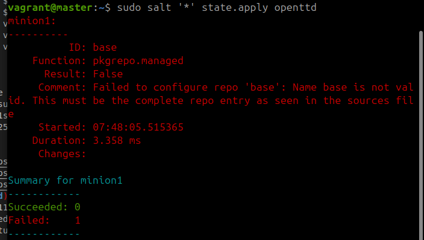

# Salt -komentojen testaaminen paikallisesti virtuaalikoneella

h1 Viisikko
Raportti on kirjoitettu perjantaina 2024-11-06 käyttämällä Asus ROG Strix GT15 -tietokonetta, tarkemmat tiedot raportin lopussa.

Raportti on kirjoitettu uudestaan opettajan pyynnöstä.

## x) Salt lyhyesti

Tällä sivustolla raportoin Salt -komentojen testaamisen. Raportoinnin mallina toimii Karvisen (2018) opas raportoinnista. Kerron raportissa mitä tein ja mitä kokeilussani tapahtui. Tämän tekstin pohjalta, niinkuin yleisestikin raporttien pohjalta voit nähdä toistettavat työvaiheet ja kokeilla samaa myös omalla työasemallasi.

Raportista on nähtävä täsmällisesti tehdyt asiat kellonaikoineen. Raportoin nämä joko kuvankaappauksina tai tekstimuotoisina:
´sudo apt-get update´

Saltilla voit ohjata muita verkkoon liitettyjä laitteita. Pääperiaatteena yksi tietokone, master, antaa komennot useille tietokoneille, minioneille, jotka toteuttavat komennot idempotentisti. Idempotentti tarkoittaa, ettei komentoa suoriteta, jos sen lopputulos on jo voimassa. (Karvinen 2018).

Master-koneelle asennetaan `salt-master` -paketti. Komentojen suorittamiseksi verkon yli sovellus tarviksee portit 4505/tcp ja 4506/tcp (Karvinen 2018).

    $ sudo apt-get update  
    $ sudo apt-get -y install salt-master  

Minion-koneelle asennetaan `salt-minion` -paketti, jonka jälkeen master -koneen tiedot asetetaan tiedostoon `/etc/salt/minion` parametriin `master`. Aina kun salt-minion asetuksia muutetaan, ohjelma täytyy uudelleenkäynnistää. Kun uusi minion on luotu sen avain pitää vielä hyväksyä master koneella. (Karvinen 2018).

    $ sudo apt-get update  
    $ sudo apt-get -y install salt-minion  
    $ cat /etc/salt/minion > master: [your ip]  
    $ sudoedit /etc/salt/minion  
    $ sudo systemctl restart salt-minion.service  

Ja sitten master-koneella:

    $ sudo salt-key -A

Tämän jälkeen master-koneella ajetut `salt` -komennot ajetaan myös minion koneilla. Ensimmäinen salt -komennon parametri `'*'` viittaa minion-koneisiin, joissa komento ajetaan. Tässä listaus joistakin komennoista, joita voi käyttää:

    $ sudo salt '*' cmd.run 'whoami'  
    $ sudo salt '*' cmd.run 'hostname -I'  
    $ sudo salt '*' grains.items|less  
    $ sudo salt '*' grains.items  
    $ sudo salt '*' grains.item virtual  
    $ sudo salt '*' pkg.install httpie  
    $ sudo salt '*' sys.doc|less  
Lähde: Karvinen 2018

Salt -komentoja halutaan ajaa tilafunktioina, jolloin ne suorittavat aina jonkin tilan. Voit ajaa tilafunktioita myös lokaalisti omalla koneella pelkällä salt-minion -paketilla. Tällöin käytetään komentoa `salt-call` parametreilla `--local`. (Karvinen 2021). Yksittäisen tilan ajaminen onnistuu käyttämällä parametria `state.single` ja käyttämällä jotakin tilaa esimerkiksi `pkg.installed`. (KArvinen 2021). Esimerkiksi:

     sudo salt-call --local -l info state.single pkg.installed tree

Tämä komento varmistaa lokaalisti, että koneella on asennettu tree -paketti. 

## a) Asenna Debian 12-Nookworm virtuaalikoneeseen

Tero Karvinen (2024) on kirjoittanut ohjeet virtuaalikoneen asentamiseen ja seurasin näitä ohjeita. Minun tapauksessani sain virheen:

>This kernel requires x86-64 but only detected an i686 CPU

Tämä korjaantui muokkaamalla setuksista enable I/O APIC ja sallimalla virtuaalikoneelle 2 prosessoria.

Lopuksi asensin vielä distron päivitykset ja palomuurin kun salt-minionin asentaminen ei onnistunut ensimmäisellä yrittämällä.

    $ sudo apt-get -y install ufw
    $ sudo apt-get -y dist-upgrade
    $ sudo ufw enable

## b) Salt-minion -paketin asentaminen koneeseen
09.53 Päivitetään paketit:

    $ sudo apt-get update 
    $ sudo apt-get -y install salt-minion

Salt-minion -paketin asentamisessa tapahtui virhe ja pakettia ei löytynyt. Asensin Debianiin myös distron päivitykset ennen kuin kokeilin uudestaan.

Kokeillaan uudestaan:

    $ sudo apt-get -y install salt-minion
    $ sudo salt-call --version

## Lähteet

Karvinen, Tero 2023. Run Salt Command Locally. Lähde: https://terokarvinen.com/2021/salt-run-command-locally/ (Luettu 28.10.2024)
Karvinen, Tero 2018. Salt Quickstart – Salt Stack Master and Slave on Ubuntu Linux. Lähde: https://terokarvinen.com/2018/03/28/salt-quickstart-salt-stack-master-and-slave-on-ubuntu-linux/ (Luettu 28.10.2024)
Karvinen, Tero 2006. Raportin kirjoittaminen – Salt Stack Master and Slave on Ubuntu Linux. Lähde: https://terokarvinen.com/2006/06/04/raportin-kirjoittaminen-4/ (Luettu 28.10.2024)
Karvinen, Tero 2024. Install Debian on Virtualbox - Updated 2024. Lähde: https://terokarvinen.com/2021/install-debian-on-virtualbox/ (Luettu 2024.11.06)

## Käytettyjen laitteiden tekniset tiedot

Asus ROG Strix GT15

-   Suoritin: Intel® Core™ i5-10400F -6-ydinsuoritin, 2,9-4,3 GHz, 12 Mt välimuisti
-   Piirisarja: Intel® B460
-   Keskusmuisti: 16 Gt DDR4 2933 MHz
-   Tallennustila: 512 Gt M.2 NVMe PCIe 3.0 SSD
-   Näytönohjain: NVIDIA® GeForce® GTX 1660 6GB (1x HDMI, 1x DP, 1 x DVI)
-   Ääni: SupremeFX S1220A Codec
-   Verkko: Gigabit Ethernet, Intel WiFi 6 (802.11ax), Bluetooth 5.0
-   Käyttöjärjestelmä: Windows 10 Home 64-bit

Tätä dokumenttia saa kopioida ja muokata GNU General Public License (versio 2 tai uudempi) mukaisesti. http://www.gnu.org/licenses/gpl.html