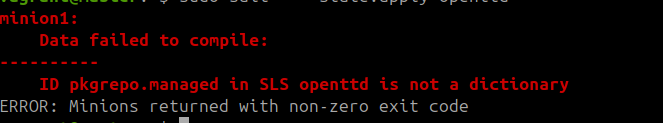
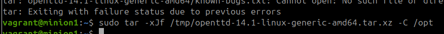
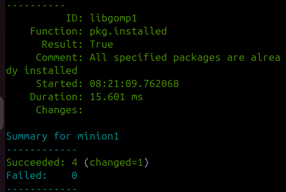

# Salt -komentojen testaaminen paikallisesti virtuaalikoneella

h1 Viisikko
Raportti on kirjoitettu perjantaina 2024-11-06 käyttämällä Asus ROG Strix GT15 -tietokonetta, tarkemmat tiedot raportin lopussa.

Raportti on kirjoitettu uudestaan opettajan pyynnöstä.

## x) Salt lyhyesti

Tällä sivustolla raportoin Salt -komentojen testaamisen. Raportoinnin mallina toimii Karvisen (2018) opas raportoinnista. Kerron raportissa mitä tein ja mitä kokeilussani tapahtui. Tämän tekstin pohjalta, niinkuin yleisestikin raporttien pohjalta voit nähdä toistettavat työvaiheet ja kokeilla samaa myös omalla työasemallasi.

Raportista on nähtävä täsmällisesti tehdyt asiat kellonaikoineen. Raportoin nämä joko kuvankaappauksina tai tekstimuotoisina:
´sudo apt-get update´

Saltilla voit ohjata muita verkkoon liitettyjä laitteita. Pääperiaatteena yksi tietokone, master, antaa komennot useille tietokoneille, minioneille, jotka toteuttavat komennot idempotentisti. Idempotentti tarkoittaa, ettei komentoa suoriteta, jos sen lopputulos on jo voimassa. (Karvinen 2018).

Master-koneelle asennetaan `salt-master` -paketti. Komentojen suorittamiseksi verkon yli sovellus tarviksee portit 4505/tcp ja 4506/tcp (Karvinen 2018).

    $ sudo apt-get update  
    $ sudo apt-get -y install salt-master  

Minion-koneelle asennetaan `salt-minion` -paketti, jonka jälkeen master -koneen tiedot asetetaan tiedostoon `/etc/salt/minion` parametriin `master`. Aina kun salt-minion asetuksia muutetaan, ohjelma täytyy uudelleenkäynnistää. Kun uusi minion on luotu sen avain pitää vielä hyväksyä master koneella. (Karvinen 2018).

    $ sudo apt-get update  
    $ sudo apt-get -y install salt-minion  
    $ cat /etc/salt/minion > master: [your ip]  
    $ sudoedit /etc/salt/minion  
    $ sudo systemctl restart salt-minion.service  

Ja sitten master-koneella:

    $ sudo salt-key -A

Tämän jälkeen master-koneella ajetut `salt` -komennot ajetaan myös minion koneilla. Ensimmäinen salt -komennon parametri `'*'` viittaa minion-koneisiin, joissa komento ajetaan. Tässä listaus joistakin komennoista, joita voi käyttää:

    $ sudo salt '*' cmd.run 'whoami'  
    $ sudo salt '*' cmd.run 'hostname -I'  
    $ sudo salt '*' grains.items|less  
    $ sudo salt '*' grains.items  
    $ sudo salt '*' grains.item virtual  
    $ sudo salt '*' pkg.install httpie  
    $ sudo salt '*' sys.doc|less  
Lähde: Karvinen 2018

Salt -komentoja halutaan ajaa tilafunktioina, jolloin ne suorittavat aina jonkin tilan. Voit ajaa tilafunktioita myös lokaalisti omalla koneella pelkällä salt-minion -paketilla. Tällöin käytetään komentoa `salt-call` parametreilla `--local`. (Karvinen 2021). Yksittäisen tilan ajaminen onnistuu käyttämällä parametria `state.single` ja käyttämällä jotakin tilaa esimerkiksi `pkg.installed`. (KArvinen 2021). Esimerkiksi:

     sudo salt-call --local -l info state.single pkg.installed tree

Tämä komento varmistaa lokaalisti, että koneella on asennettu tree -paketti. 

## a) Asenna Debian 12-Nookworm virtuaalikoneeseen

Tero Karvinen (2024) on kirjoittanut ohjeet virtuaalikoneen asentamiseen ja seurasin näitä ohjeita. Minun tapauksessani sain virheen:

>This kernel requires x86-64 but only detected an i686 CPU

Tämä korjaantui muokkaamalla setuksista enable I/O APIC ja sallimalla virtuaalikoneelle 2 prosessoria.

Lopuksi asensin vielä distron päivitykset ja palomuurin kun salt-minionin asentaminen ei onnistunut ensimmäisellä yrittämällä.

    $ sudo apt-get -y dist-upgrade
    $ sudo apt-get -y install ufw
    $ sudo ufw enable

## b) Salt-minion -paketin asentaminen koneeseen
09.53 Päivitetään paketit:

    $ sudo apt-get update 
    $ sudo apt-get -y install salt-minion

Salt-minion -paketin asentamisessa tapahtui virhe ja pakettia ei löytynyt. Asensin Debianiin myös distron päivitykset ennen kuin kokeilin uudestaan.

10.02 Kokeillaan uudestaan:

    $ sudo apt-get -y install salt-minion
    $ sudo salt-call --version

10.22 Kokeilin seuraavaksi asentaa paketin tiedot tehtävänannon mukaisesti, mutta tässäkin tuli ongelma vastaan, sillä repo.saltproject-io -hostia ei löytynyt:

10.26 Lopulta paketin asennus onnistui uusilla osoitteilla Saltprojektin ohjeiden mukaan. (Saltproject 2024)

    $ mkdir -p /etc/apt/keyrings
    $ sudo curl -fsSL https://packages.broadcom.com/artifactory/api/security/keypair/SaltProjectKey/public | sudo tee /etc/apt/keyrings/salt-archive-keyring.pgp
    $ sudo curl -fsSL https://github.com/saltstack/salt-install-guide/releases/latest/download/salt.sources | sudo tee /etc/apt/sources.list.d/salt.sources
    $ sudo apt-get update
    $ sudo apt-get install -y salt-minion
    $ salt-call --version

10.30 Muokkasin salt-minion asetuksia niin, että masteriksi asetettiin lokaali tietokone `master: local`. Tämä muokkaus kuitenkin tuotti ongelman:

Koska olin tiedostoa tallentaessa vahingossa onnistunut syöttämään ensimmäiselle riville pilkun.

## c) Komentojen käyttäminen paikallisesti

10.38 Kokeillaan ensin file.managed -tilafunktiota 
    sudo salt-call --local -l info state.single file.managed /tmp/moro
¨
    
Tilan onnistumisen pystyy takristamaan komennolla 
        
        ls/tmp
10.41 Seuraavaksi vuorossa on pkg -tila
    sudo salt-call --local -l info state.single pkg.installed tree

10.43 Seuraavaksi vuorossa on service -tila
    sudo salt-call --local -l info service.running enable=False
    sudo salt-call --local -l info service.running enable=True

    $ sudo salt-call --local -l info state.single user.present vierailija

10.47 cmd.run

## d) Idempotenssi

e)
10.50 
    sudo apt-get install salt-master

Siitä tuli error The key glob '*' does not match any unaccepted keys. Minkä luulen takroittavan ettei salt-miniopn ole vielä ottanut yhteyttä. Kokeillaan käynnistää salt-minion uudestaan.

10.52 master: local on jo asetettu, joten nyt vain kokeillaan lisätään avain
    
    $ sudo sudo salt-key -A
    
10.53 Tämä ei toiminut, joten yritin laittaa ufw -palomuurin kiinni  
10.57 Tämäkään ei toiminut, joten muutin master: localhost -parametrin vastaamaan lokaalia ip -osoitetta 

    hostname -I 

11.12 Tämäkään ei toiminut. Selvittelin ongelmaa komennoilla sudo salt-key -L, joka ei näyttänyt avainta listassa. MYös sudo salt 'nice_minion' test.ping ,joka näytti etttei masteriin saada yhteyttä.

11.22 Pienen selvittelyn jälkeen selvitin ChatGPT:ltä että masterin asetuksissa voi myös manuaalisesti määritellä portin ja osoitteet. Laitoin nämä asetukset voimaan ja uudelleenkäynnistin masterin:
    
    interface: 0.0.0.0
    publish_port: 4505

11.24 Otin kuitenkin nämä asetukset pois masterin konfiguraatiosta ja kokeilin uudestaan pingata masteri ja se toimi. Todennäköisesti siis pelkkä salt-masterin uudelleenkäynnistys olisi ratkaissut ongelman.

## Lähteet
Saltproject 2024. Linux (DEB). Lähde:  https://docs.saltproject.io/salt/install-guide/en/latest/topics/install-by-operating-system/linux-deb.html#install-deb (Luettu: 06.11.2024)
Karvinen, Tero 2023. Run Salt Command Locally. Lähde: https://terokarvinen.com/2021/salt-run-command-locally/ (Luettu 28.10.2024)
Karvinen, Tero 2018. Salt Quickstart – Salt Stack Master and Slave on Ubuntu Linux. Lähde: https://terokarvinen.com/2018/03/28/salt-quickstart-salt-stack-master-and-slave-on-ubuntu-linux/ (Luettu 28.10.2024)
Karvinen, Tero 2006. Raportin kirjoittaminen – Salt Stack Master and Slave on Ubuntu Linux. Lähde: https://terokarvinen.com/2006/06/04/raportin-kirjoittaminen-4/ (Luettu 28.10.2024)
Karvinen, Tero 2024. Install Debian on Virtualbox - Updated 2024. Lähde: https://terokarvinen.com/2021/install-debian-on-virtualbox/ (Luettu 2024.11.06)

## Käytettyjen laitteiden tekniset tiedot

Asus ROG Strix GT15

-   Suoritin: Intel® Core™ i5-10400F -6-ydinsuoritin, 2,9-4,3 GHz, 12 Mt välimuisti
-   Piirisarja: Intel® B460
-   Keskusmuisti: 16 Gt DDR4 2933 MHz
-   Tallennustila: 512 Gt M.2 NVMe PCIe 3.0 SSD
-   Näytönohjain: NVIDIA® GeForce® GTX 1660 6GB (1x HDMI, 1x DP, 1 x DVI)
-   Ääni: SupremeFX S1220A Codec
-   Verkko: Gigabit Ethernet, Intel WiFi 6 (802.11ax), Bluetooth 5.0
-   Käyttöjärjestelmä: Windows 10 Home 64-bit

Tätä dokumenttia saa kopioida ja muokata GNU General Public License (versio 2 tai uudempi) mukaisesti. http://www.gnu.org/licenses/gpl.html

Pohjautuu Palvelinten hallinta -kurssin tehtävään: https://terokarvinen.com/palvelinten-hallinta/