# Salt -komentojen testaaminen paikallisesti virtuaalikoneella

h2 Infra-as-code
Raportti on kirjoitettu 2024-11-06 ja 10.11.2024 käyttämällä Asus ROG Strix GT15 -tietokonetta, tarkemmat tiedot raportin lopussa.

Komentotyökaluna on käytetty Git Bash -työkalua, joten komennot vastaavat paremmin Linux -ympäristöjä.

Raportoinnin mallina toimii Karvisen (2018) opas raportoinnista ja raportti on tehty osana palvelintan hallinta -opintojaksoa (Karvinen 2024).

## x) Infrastructure as code with salt stack

Tähän asti olemme käyttäneet VirtualBoxia virtuaalikoneiden hallinnoimiseen. Useiden virtuaalikoneiden hallinnoiminen tapahtuu kätevästi `vagrant` paketilla. Toimiakseen paketti tarvitsee myös `virtualbox` -paketin. (Karvinen 2021). Kun nämä on asennettuna luodaan projektikansio.

    $ mkdir vagrantProject/
    $ cd vagrantProject/
    $ nano Vagrantfile

Ja Vagrantille konfigurointitiedosto Karvisen (2021) ohjeen mukaisesti.

    # -*- mode: ruby -*-
    # vi: set ft=ruby :
    # Copyright 2019-2021 Tero Karvinen http://TeroKarvinen.com

    $tscript = <<TSCRIPT
    set -o verbose
    apt-get update
    apt-get -y install tree
    echo "Done - set up test environment - https://terokarvinen.com/search/?q=vagrant"
    TSCRIPT

    Vagrant.configure("2") do |config|
        config.vm.synced_folder ".", "/vagrant", disabled: true
        config.vm.synced_folder "shared/", "/home/vagrant/shared", create: true
        config.vm.provision "shell", inline: $tscript
        config.vm.box = "debian/bullseye64"

        config.vm.define "t001" do |t001|
            t001.vm.hostname = "t001"
            t001.vm.network "private_network", ip: "192.168.88.101"
        end

        config.vm.define "t002", primary: true do |t002|
            t002.vm.hostname = "t002"
            t002.vm.network "private_network", ip: "192.168.88.102"
        end
        
    end

Virtuaalikoneet voi käynnistää ja sulkea komennoilla.
    
    $ vagrant destroy
    $ vagrant up

Tämän jälkeen virtuaalikoneen bashin voi avata ja sulkea käyttämällä komentoja `ssh [vmName]` ja `exit`. Voit myös kokeilla yhteyttä komennolla `ping -c 1 [ip]` (Karvinen 2021). Esimerkiksi

    $ vagrant ssh t001
    vagrant@t001$ ping -c 1 192.168.88.102
    vagrant@t001$ exit

Nyt kun virtuaalikoneet ovat päällä voit ottaa niissä käyttöön herra-orjaarkkitehtuurin ja testata sen toimintaa ajamalla seuraavat komennot (Karvinen 2018, 2021):
    
    $ vagrant ssh t001
    vagrant@t001$ sudo apt-get update
    vagrant@t001$ sudo apt-get -y install salt-master
    vagrant@t001$ exit
    $ vagrant ssh t002
    vagrant@t002$ sudo apt-get update
    vagrant@t002$ sudo apt-get -y install salt-minion
    vagrant@t002$ sudoedit /etc/salt/minion
        master: 192.168.88.101
    vagrant@t002$ sudo systemctl restart salt-minion.service
    vagrant@t002$ exit
    $ vagrant ssh t001
    vagrant@t001$ sudo salt-key -A #Accept the Key
    vagrant@t001$ sudo salt '*' cmd.run 'whoami'

Haluamme Saltilla ajaa aina valmiiksi määriteltyjä tiloja minion -koneisiin. Tämä tapahtuu luomalla .sls tilatiedostoja yaml ohjelmointikielellä master-koneelle. Tilan luominen ja ajaminen tapahtuu seuraavasti (Karvinen 2014):
    
    $ mkdir /srv/salt/testState
    $ sudoedit /srv/salt/init.sls
        /tmp/testFile:
            file.managed
    $ sudo salt '*' state.apply testState

Lokaalisti sama tehtäisiin minion koneella ja ajettaisiin komento (Karvinen 2014):

    $ sudo salt-call --local state.apply testState

SaltStack käyttää tilojen määrittelyssä YAML -merkintäkieltä. Siinä data rakentuu `key: value` -pareina. Markintäkieli on case-sensitive. (Saltproject 2024). YAML:ssa suurin erityisyys mielestäni on se, että välilyönnit ja tabulaattorit ovat olennainen osa merkintäkieltä. Niitä siis tulee käyttää tarkasti ja tabulaattorit ovat esimerkiksi kielletty (Saltproject 2024). 

YAML -dataparit voidaan jakaa kolmeen tyyppiin. Meillä on perus **Scalars** `key: value` -parit, joissa arvot voivat olla numeroita, tekstiä tai totuusarvoja. Listat **Lists** ovat toinen tyyppi ja seuraavat syntaksia, jossa listan arvoja edeltää aina  '  - ' (Saltproject 2024):
        list: 
          - item
          - item

Kolmas tyyppi ovat sanakirjastot **Dictionaries**, jotka sisältävät toisia perus **Scalars** arvoja (Saltproject 2024):
        list: 
          list: 
            - item
            - item
          key: value

## a) Vagrantin asennus Windowsille
10.11.2024 8.00 Latasin Vagrantin Installer Windowsille ja asensin sen. Käytin AMD64 installeria ja oletusasetuksia.  
8.07 Vagrantin version tarkistin `vagrant` komennolla.  
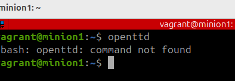 
## b) Linux virtuaalikoneen tekeminen Vagrantilla

8.08 Loin projektikansion ja siihen tiedoston **Vagrantfile**. Tiedoston sisällöksi kopioin aikaisemmin raportissa esitetyn vagrantkonfiguroinnin.  
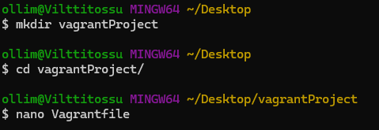  
8.17 Kokeilin käynnistää ensin virtuaalikoneet väärällä komennolla (suoraan syöttämällä `vagrant ssh t001`) ja sain ilmoituksen:  
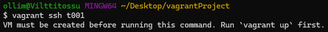   
Vagrantin konfiguroinnissa olevat virtuaalikoneet siis pitää aina käynnistää yhdessä komennolla `vagrant up`. Koska ensin piti kokeilla yhden virtuaalikoneen käynnistämistä, halusin ensin poistaa Vagrantfile tiedostosta nämä rivit:  

        config.vm.define "t002", primary: true do |t002|
            t002.vm.hostname = "t002"
            t002.vm.network "private_network", ip: "192.168.88.102"
        end

Tämän jälkeen käynnistin yhden virtuaalikoneen, avasin komentpokehotteen ja lähdin virtuaalikoneesta komennoilla:

        $ vagrant up
        $ vagrant ssh t001
        $t001 exit

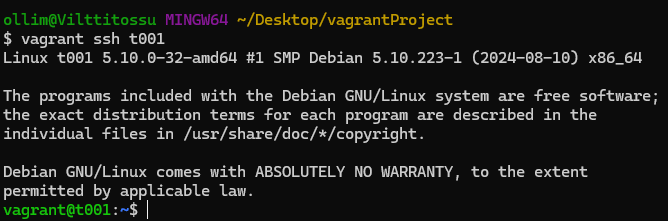  

## c) Linux virtuaalikoneiden liittäminen samaan verkkoon

8.21 Nyt lisäsin Vagrantfile -tiedostoon uudestaan rivit, jotka konfiguroivat myös toisen virtuaalikoneen. Ensin tuhosin virtuaalikoneen vanhalla konfiguroinnilla.

        $ vagrant destroy
        $ nano Vagrantfile

8.24 käynnistin molemmat virtuaalikoneet t001 ja t002 sekä testasin niiden välisen verkkoyhteyden komennoilla  

        $ vagrant up
        $ vagrant ssh t001
        $t001 ping 192.168.88.102
        $t001 exit
        $ vagrant ssh t02
        $t002  ping 192.168.88.101

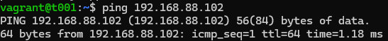 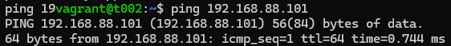

## d) Herra-orja-arkkitehtyyrin perustaminen virtuaalikoneille
Avasin myös toisen komentokehotteen, jotta ei tarvitsisi toistella komentoja vagrant `ssh` ja `exit`  
8.32 Opin että `vagrant` komentoja pitää virtuaalikoneiden luomisenkin jälkeen ajaa nimenomaa projektikansiossa. Oletoin että virtuaalikoneet olisivat myös muualta saatavissa, sillä Dockerissa esimerkiksi on näin. Kokeilin ensin ajaa `vagrant ssh` -komentoa eri kansiossa:
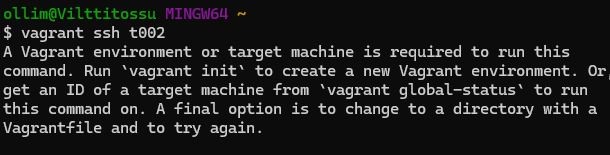  

8.34 Käynnistin molemmat virtuaalikoneet eri terminaaleilla:  

        $ vagrant ssh t001
        $ vagrant ssh t002

Ensimmäisellä kerralla kun aloin lataamaan Saltstackin paketteja kokeilin tehdä sen näin: 

         $t001  sudo apt-get update
         $t001  sudo apt-get -y install salt-master
         
Törmäsin kuitenkin taas ongelmaan pakettien puuttumisesta, joka oli ollut haaste myös h1 -tehtävässä aikaisemmin.   
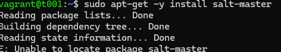  

8.39 Kun yritin tehdä komentoja paketin ja niiden avaimien asentamiseksi huomasin että `curl` -paketit puuttuvat virtuaalikoneilta. Asensin ne ja muutkin päivitykset molempiin koneisiin komennoilla:

        $t001  sudo apt-get update; sudo apt-get upgrade
        $t001  sudo apt-get install curl
        $t002  sudo apt-get update; sudo apt-get upgrade
        $t002  sudo apt-get install curl
        
Asensin saltin master-koneelle lopulta seuraavasti:  

        $t001 sudo mkdir -p /etc/apt/keyrings
        $t001 sudo curl -fsSL https://packages.broadcom.com/artifactory/api/security/keypair/SaltProjectKey/public | sudo tee /etc/apt/keyrings/salt-archive-keyring.pgp
        $t001 sudo curl -fsSL https://github.com/saltstack/salt-install-guide/releases/latest/download/salt.sources | sudo tee /etc/apt/sources.list.d/salt.sources
        $t001 sudo apt-get update
        $t001 sudo apt-get update
        $t001 sudo apt-get -y install salt-master

8.47 Ja minion koneelle seuraavasti:

        t002 sudo mkdir -p /etc/apt/keyrings
        t002 sudo curl -fsSL https://packages.broadcom.com/artifactory/api/security/keypair/SaltProjectKey/public | sudo tee /etc/apt/keyrings/salt-archive-keyring.pgp
        t002 sudo curl -fsSL https://github.com/saltstack/salt-install-guide/releases/latest/download/salt.sources | sudo tee /etc/apt/sources.list.d/salt.sources
        t002 sudo apt-get update
        t002 sudo apt-get update
        t002 sudo apt-get -y install salt-minion

Lopuksi testasin että asennukset onnistuivat `salt-call --version` -komennolla:   
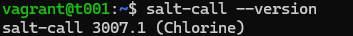  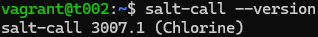  

8.53 Konfiguroin minion koneen ottamaan käskyjä masterilta:

        $t002 sudoedit etc/salt/minion 
            master: 192.168.88.101
        $t002 sudo systemctl restart salt-minion.service

8.55 Hyväksyin avaimen hostilla, mikä epäonnistui, joten käynnistin masterin uudestaan. Uudelleenkäynnistämisen jälkeen avaimien hyväksyminen toimi.  
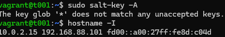

        $t001 sudo systemctl restart salt-master.service

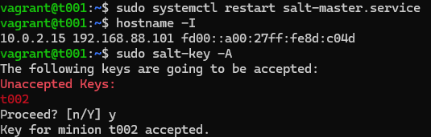

8.57. Palasin tehtävään x) ja opiskelin yaml -syntaksia ennen seuraavan tehtävän aloittamista. 

## e) Sls-tiedostojen hyödyntäminen lokaalisti

9.12 Yritin luoda aluksi .sls tiedostoa minionille `mkdir /srv/salt/testState` -komennolla, mutta huomasin että kansio pitää erikseen luoda toisin kuin /etc/salt/ -kansio:

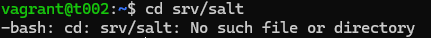  

       $t002 sudo mkdir /srv/salt
       $t002 sudo mkdir /srv/salt/testState

9.16 nyt isänpäivän viettoon!  

11.11.2024 8.09 Virtuaalikoneet olivat vielä käynnissä koneellani, joten jatkoin suoraan siitä mihin jäin sunnuntaina. Loin siis tilan minion -koneelle, jotta sen voisi ajaa paikallisesti.

        $t002 sudoedit /srv/salt/testState/init.sls  
            /tmp/testFile:
              file.managed
        $t002 sudo salt --local state.apply testState

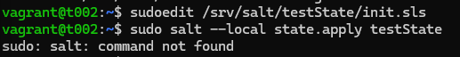  

8.10 Olin valinnut väärän komennon, minkä takia edellinen epäonnistui. `Salt-stack`, `salt` ja `salt-call`, menevätkin nyt helposti sekaisin, enkä ymmärrä täysin näiden kolmen käsitteen sisältöjä. Ilmeisimmin `salt` on salt-masterin komento ja `salt-call`, sitten jotain muuta? ehkä minionin komento? Yritin aluksi ladata salt -komennon minion koneelle, mikä ei oikeastaan auttanut tehtävässä. Vasta viimeinen komento tällä rivillä on oikea ratkaisu:

        $t002 sudo apt-get install salt-master
        $t002 sudo salt --local state.apply testState
        $t002 sudo salt-call --local state.apply testState

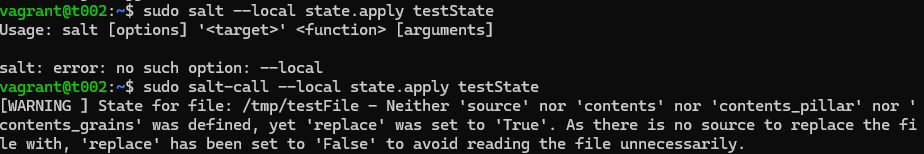  
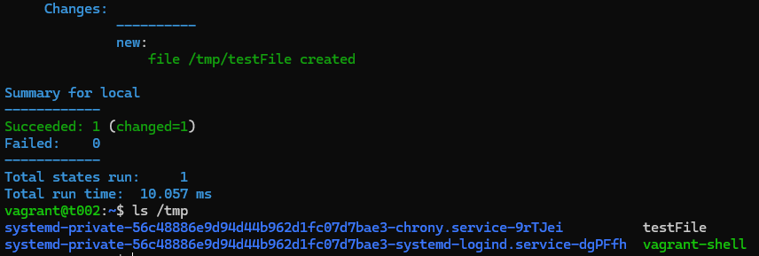  

## f) Sls-tiedostojen hyödyntäminen verkossa

8.15 Seuraavaksi loin tilan master-koneelle, jotta voisin ajaa sen verkon yli minion-koneelle, käytin kuitenkin väärin salt `state.single` -komentoa, joten sain virheen:

    $t001 sudo mkdir /srv/salt
    $t001 sudo mkdir /srv/salt/testState
    $t002 sudoedit /srv/salt/testState/init.sls  
        /tmp/testFile:
          file.managed
    $  salt '*' state.single testState  

    [WARNING ] TCP Publish Client encountered an exception while connecting to /var/run/salt/master/master_event_pub.ipc: StreamClosedError('Stream is closed'), will reconnect in 1 seconds -   File "/usr/bin/salt", line 11, in <module>
    sys.exit(salt_main())

    File "/opt/saltstack/salt/lib/python3.10/site-packages/salt/scripts.py", line 528, in salt_main
        client.run()

    File "/opt/saltstack/salt/lib/python3.10/site-packages/salt/cli/salt.py", line 192, in run
        for full_ret in cmd_func(**kwargs):

    File "/opt/saltstack/salt/lib/python3.10/site-packages/salt/client/__init__.py", line 815, in cmd_cli
        self.pub_data = self.run_job(

    File "/opt/saltstack/salt/lib/python3.10/site-packages/salt/client/__init__.py", line 387, in run_job
        pub_data = self.pub(

    File "/opt/saltstack/salt/lib/python3.10/site-packages/salt/client/__init__.py", line 1904, in pub
        if listen and not self.event.connect_pub(timeout=timeout):

    File "/opt/saltstack/salt/lib/python3.10/site-packages/salt/utils/event.py", line 323, in connect_pub
        self.subscriber = salt.utils.asynchronous.SyncWrapper(

    File "/opt/saltstack/salt/lib/python3.10/site-packages/salt/utils/asynchronous.py", line 76, in __init__
        self.obj = cls(*args, **kwargs)

    File "/opt/saltstack/salt/lib/python3.10/site-packages/salt/transport/base.py", line 210, in ipc_publish_client
        return publish_client(opts, io_loop, **kwargs)

    File "/opt/saltstack/salt/lib/python3.10/site-packages/salt/transport/base.py", line 152, in publish_client
        return salt.transport.tcp.PublishClient(

    File "/opt/saltstack/salt/lib/python3.10/site-packages/salt/transport/tcp.py", line 220, in __init__
        super().__init__(opts, io_loop, **kwargs)

    File "/opt/saltstack/salt/lib/python3.10/site-packages/salt/transport/base.py", line 398, in __init__
        super().__init__()

8.20 `state.apply` oli tässä oikea valinta ja näin sain tilan ajettua. Koska kyseessä oli sama tila, jota ajoin paikallisesti minion-koneella, tila ei muuttanut mitään koska tilafunktiot ajetaan aina idempotentisti.

        $t001 sudo salt '*' state.apply testState

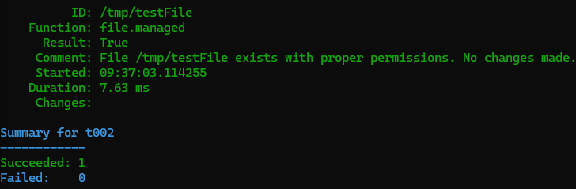

## g) Sls-tiedoston laajentaminen ja idempotenssin testaaminen
8.21 Loin tilan, joka luo käyttäjän ja luo hänelle index.html -sivun. 

    $t001 sudo mkdir /srv/salt/testMany
    $t001 sudoedit /srv/salt/testMany/init.sls

    testUser:
      user.present
    home/user/index.html:
      file.managed

    $t001 sudo salt '*' state.apply testMany

8.29 Olin kirjoittanut suhteellisen polun, joka piti nyt muuttaa absoluuttiseksi.
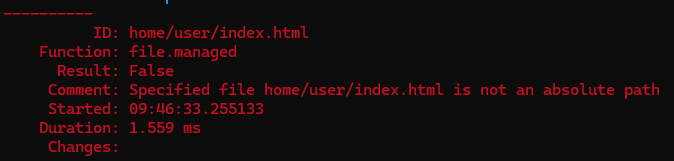  

        $t001 sudoedit /srv/salt/testMany/init.sls
            /home/user/index.html:
        $t001 sudo salt '*' state.apply testMany
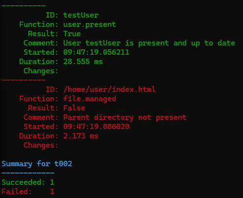 

8.32 Jotain häikkää tilassa edelleen olin ja tarkistinkin seuraavaksi loiko `user.present` kansion käyttäjälle.

        $t002 cd /home
        $t002 ls

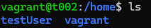  

Nähtävästi olin luonut käyttäjän **testUser** ja yrittänyt muokata kansiota **/user**, joten korjasin vielä nämä ja ajoin tilan uudestaan. Samalla kun ajoin tilaa uudestaan korjatessani virheitä tuli samalla osoitettua tilan idempotenssi. Eli käyttäjää ei luotu uudelleen, sillä se oli jo minionilla. 

        $t001 sudoedit /srv/salt/testMany/init.sls
            home/testUser/index.html:
        $t001 sudo salt '*' state.apply testMany
        $t002 ls -a -l

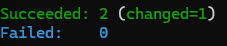  

Huomasi edellistä kohtaa tarkistaessani, että tiedoston omistajuus oli nyt **root** käyttäjällä, mikä ei ollut tarkoitukseni. Kysyin ensin ChatGPT:ltä apua siihen, mitä tilafunktiota tämän tilanteen korjaamiseksi kannattaisi käyttää. Lähdikin sen viitoittamana tutustumaan syvemmin file.managed -tilafunktioon saltin dokumentaation pohjalta (Saltproject 2024b). Muokkasin ohjeiden pohjalta tilan konfiguraatiota:

        $t001:~$ sudoedit /srv/salt/testMany/init.sls
        $t001:~$ sudo salt '*' state.apply testMany
            file.managed:
              - user: testUser

8.40 tarkistin että omistajuus siirtyi käyttäjälle:

        $t002 ls -a -l

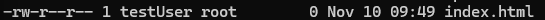  

## h) Useiden tilojen hyödyntäminen

8.45 Loin toisen tilan testPing ja ajoin minion -koneella.

    $t001 sudo mkdir /srv/salt/testPing
    $t001 sudoedit /srv/salt/testPing/init.sls
        'whoami':
          cmd.run
        'hostname -I':
          cmd.run
    $t001 sudo salt '*' state.apply

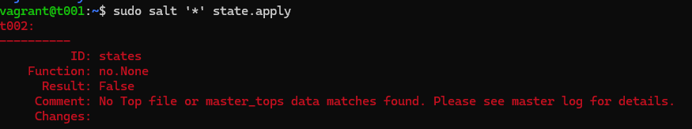  
9.46 muutin vielä tiedostonimen top.sls ja sen sisällön seuraavaksi:

        base:
          '*':
            - testState/init
            - testPing/init

Ja ajoin tilat: $t001 sudo salt '*' state.apply

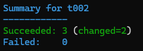  
Lopuksi pysäytin virtuaalikoneet.

    $t001 exit
    $t002 exit
    $ vagrant suspend

## h) Apachen asentaminen ja konfigurointi
Tämä vasta viikolla 47 kun oppitunti on ollut

## Lähteet
Karvinen, Tero 2006. Raportin kirjoittaminen – Salt Stack Master and Slave on Ubuntu Linux. Lähde: [https://terokarvinen.com/2006/06/04/raportin-kirjoittaminen-4/](https://terokarvinen.com/2006/06/04/raportin-kirjoittaminen-4/) (Luettu 28.10.2024)  
Karvinen, Tero 2024. Palvelinten Hallinta - Configuration Management Systems course - 2024 autumn. Lähde: [https://terokarvinen.com/palvelinten-hallinta/](https://terokarvinen.com/palvelinten-hallinta/) (Luettu 2024.11.06)   
Karvinen, Tero 2021. Two Machine Virtual Network With Debian 11 Bullseye and Vagrant [https://terokarvinen.com/2021/two-machine-virtual-network-with-debian-11-bullseye-and-vagrant/](https://terokarvinen.com/2021/two-machine-virtual-network-with-debian-11-bullseye-and-vagrant/)(Luettu 07.11.2024)  
Karvinen, Tero 2018. TSalt Quickstart – Salt Stack Master and Slave on Ubuntu Linux [https://terokarvinen.com/2021/two-machine-virtual-network-with-debian-11-bullseye-and-vagrant/](https://terokarvinen.com/2021/two-machine-virtual-network-with-debian-11-bullseye-and-vagrant/) (Luettu 07.11.2024)  
Karvinen, Tero 2014. Hello Salt Infra-as-Code [https://terokarvinen.com/2024/hello-salt-infra-as-code/](https://terokarvinen.com/2024/hello-salt-infra-as-code/) (Luettu 07.11.2024)  
Karvinen, Tero 2023. Salt Vagrant - automatically provision one master and two slaves [https://terokarvinen.com/2023/salt-vagrant/#infra-as-code---your-wishes-as-a-text-file](https://terokarvinen.com/2023/salt-vagrant/#infra-as-code---your-wishes-as-a-text-file) (Luettu 07.11.2024)  
Saltproject 2024. Salt overview [https://docs.saltproject.io/salt/user-guide/en/latest/topics/overview.html#rules-of-yaml](https://docs.saltproject.io/salt/user-guide/en/latest/topics/overview.html#rules-of-yaml) (Luettu 07.11.2024)  
Saltproject 2024b. Salt.states.file
[https://docs.saltproject.io/en/latest/ref/states/all/salt.states.file.html](https://docs.saltproject.io/en/latest/ref/states/all/salt.states.file.html) (Luettu 11.11.2024)  

## Käytettyjen laitteiden tekniset tiedot

Asus ROG Strix GT15
-   Suoritin: Intel® Core™ i5-10400F -6-ydinsuoritin, 2,9-4,3 GHz, 12 Mt välimuisti
-   Piirisarja: Intel® B460
-   Keskusmuisti: 16 Gt DDR4 2933 MHz
-   Tallennustila: 512 Gt M.2 NVMe PCIe 3.0 SSD
-   Näytönohjain: NVIDIA® GeForce® GTX 1660 6GB (1x HDMI, 1x DP, 1 x DVI)
-   Ääni: SupremeFX S1220A Codec
-   Verkko: Gigabit Ethernet, Intel WiFi 6 (802.11ax), Bluetooth 5.0
-   Käyttöjärjestelmä: Windows 10 Home 64-bit

Tätä dokumenttia saa kopioida ja muokata GNU General Public License (versio 2 tai uudempi) mukaisesti. http://www.gnu.org/licenses/gpl.html

Pohjautuu Palvelinten hallinta -kurssin tehtävään: https://terokarvinen.com/palvelinten-hallinta/