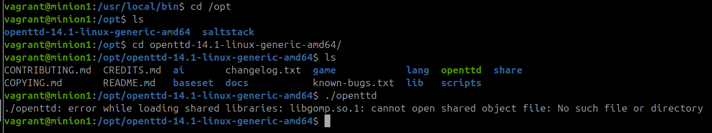
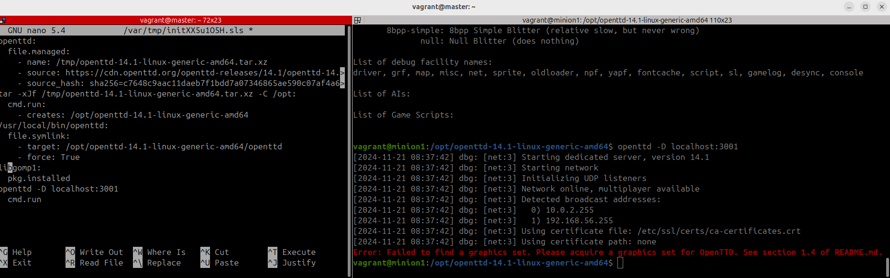

# Salt -komentojen testaaminen paikallisesti virtuaalikoneella

h2 Infra-as-code
Raportti on kirjoitettu 2024-11-06 ja 10.11.2024 käyttämällä Asus ROG Strix GT15 -tietokonetta, tarkemmat tiedot raportin lopussa.

Komentotyökaluna on käytetty Git Bash -työkalua, joten komennot vastaavat paremmin Linux -ympäristöjä.

Raportoinnin mallina toimii Karvisen (2018) opas raportoinnista ja raportti on tehty osana palvelintan hallinta -opintojaksoa (Karvinen 2024).

## x) Infrastructure as code with salt stack

Tähän asti olemme käyttäneet VirtualBoxia virtuaalikoneiden hallinnoimiseen. Useiden virtuaalikoneiden hallinnoiminen tapahtuu kätevästi `vagrant` paketilla. Toimiakseen paketti tarvitsee myös `virtualbox` -paketin. (Karvinen 2021). Kun nämä on asennettuna luodaan projektikansio.

    $ mkdir vagrantProject/
    $ cd vagrantProject/
    $ nano Vagrantfile

Ja Vagrantille konfigurointitiedosto Karvisen (2021) ohjeen mukaisesti.

    # -*- mode: ruby -*-
    # vi: set ft=ruby :
    # Copyright 2019-2021 Tero Karvinen http://TeroKarvinen.com

    $tscript = <<TSCRIPT
    set -o verbose
    apt-get update
    apt-get -y install tree
    echo "Done - set up test environment - https://terokarvinen.com/search/?q=vagrant"
    TSCRIPT

    Vagrant.configure("2") do |config|
        config.vm.synced_folder ".", "/vagrant", disabled: true
        config.vm.synced_folder "shared/", "/home/vagrant/shared", create: true
        config.vm.provision "shell", inline: $tscript
        config.vm.box = "debian/bullseye64"

        config.vm.define "t001" do |t001|
            t001.vm.hostname = "t001"
            t001.vm.network "private_network", ip: "192.168.88.101"
        end

        config.vm.define "t002", primary: true do |t002|
            t002.vm.hostname = "t002"
            t002.vm.network "private_network", ip: "192.168.88.102"
        end
        
    end

Virtuaalikoneet voi käynnistää ja sulkea komennoilla.
    
    $ vagrant destroy
    $ vagrant up

Tämän jälkeen virtuaalikoneen bashin voi avata ja sulkea käyttämällä komentoja `ssh [vmName]` ja `exit`. Voit myös kokeilla yhteyttä komennolla `ping -c 1 [ip]` (Karvinen 2021). Esimerkiksi

    $ vagrant ssh t001
    vagrant@t001$ ping -c 1 192.168.88.102
    vagrant@t001$ exit

Nyt kun virtuaalikoneet ovat päällä voit ottaa niissä käyttöön herra-orjaarkkitehtuurin ja testata sen toimintaa ajamalla seuraavat komennot (Karvinen 2018, 2021):
    
    $ vagrant ssh t001
    vagrant@t001$ sudo apt-get update
    vagrant@t001$ sudo apt-get -y install salt-master
    vagrant@t001$ exit
    $ vagrant ssh t002
    vagrant@t002$ sudo apt-get update
    vagrant@t002$ sudo apt-get -y install salt-minion
    vagrant@t002$ sudoedit /etc/salt/minion
        master: 192.168.88.101
    vagrant@t002$ sudo systemctl restart salt-minion.service
    vagrant@t002$ exit
    $ vagrant ssh t001
    vagrant@t001$ sudo salt-key -A #Accept the Key
    vagrant@t001$ sudo salt '*' cmd.run 'whoami'

Haluamme Saltilla ajaa aina valmiiksi määriteltyjä tiloja minion -koneisiin. Tämä tapahtuu luomalla .sls tilatiedostoja yaml ohjelmointikielellä master-koneelle. Tilan luominen ja ajaminen tapahtuu seuraavasti (Karvinen 2014):
    
    $ mkdir /srv/salt/testState
    $ sudoedit /srv/salt/init.sls
        /tmp/testFile:
            file.managed
    $ sudo salt '*' state.apply hello

Lokaalisti sama tehtäisiin minion koneella ja ajettaisiin komento (Karvinen 2014):

    $ sudo salt-call --local state.apply hello

## a) Vagrantin asennus Windowsille

8.00 Latasin Vagrantin Installer Windowsille ja asensin sen. Käytin AMD64 installeria ja oletusasetuksia.
## b) Linux virtuaalikoneen tekeminen Vagrantilla
8.07 Vagrantin version tarkistin `vagrant` komennolla.  
 

8.08 Loin projektikansion ja siihen tiedoston **Vagrantfile**. Tiedoston sisällöksi kopioin aikaisemmin raportissa esitetyn vagrantkonfiguroinnin.  
  
8.17 Kokeilin käynnistää ensin virtuaalikonett väärällä komennolla ja sain ilmoituksen:  
   
Vagrantin konfiguroinnissa olevat virtuaalikoneet siis pitää aina käynnistää yhdessä kokmennolla `vagrant up`. Koska ensin piti kokeilla yhden virtuaalikoneen käynnistämistä, tajusin ensin poistaa Vagrantfile tiedostosta tässä rivit:  

        config.vm.define "t002", primary: true do |t002|
            t002.vm.hostname = "t002"
            t002.vm.network "private_network", ip: "192.168.88.102"
        end

Tämän jälkeenyhden virtuaalikoneen käynnistäminen, bashin avaaminen siinä ja virtuaalikoneesta lähteminen onnistui komennoilla 

        $ vagrant up
        $ vagrant ssh t001
        $t001 exit

  

## c) Linux virtuaalikoneiden liittäminen samaan verkkoon

8.21 Nyt lisäsin Vagrantfile -tiedostoon uudestaan rivit, jotka konfiguroivat myöa toisen virtuaalikoneen. Ensi suljin virtuaalikoneen

        $ vagrant destroy
        $ nano Vagrantfile

8.24 käynnistin molemmat virtuaalikoneet t001 ja t002 sekä testasin niiden välisen verkkoyhteyden komennoilla  

        $ vagrant up
        $ vagrant ssh t001
        $t001 ping 192.168.88.102
        $t001 exit
        $ vagrant ssh t02
        $t002  ping 192.168.88.101

 

## d) Herra-orja-arkkitehtyyrin perustaminen virtuaalikoneille
Aloitin konfiguroimalla master -koneen. Avasin myös toisen komenotkehotteen, jotta ei tarvitsisi toistella komentoja vagrant `ssh` ja `exit`
8.32 Opin että vagrnat  komentoja pitää virtuaalikoneiden luomisenkin jälkeen ajaa nimenomaa projektikansiossa, kun kokeilin ajaa vagrant ssh -komentoa eri kansiossa:
  

8.34 Käynnistin molemmat virtuaalikoneet:
        $ vagrant ssh t001
        $ vagrant ssh t002

Ensimmäisellä kerralla kun aloin lataamaan saltStackin paketteja, 

         $t001  sudo apt-get update
         $t001  sudo apt-get -y install salt-master
         
törmäsin taas ongelmaan paketin puuttumisesta. 
  

8.39 Kun yritin tehdä komentoja paketin asentamiseksi huomasin että `curl` -paketti puuttuu virtuaalikoneilta. Asensin ne molempiin koneisiin komennoilla:

        $t001  sudo apt-get update; sudo apt-get upgrade
        $t001  sudo apt-get install curl
        $t002  sudo apt-get update; sudo apt-get upgrade
        $t002  sudo apt-get install curl
        
Initioin master-koneen lopulta seuraavasti:  

        $ sudo mkdir -p /etc/apt/keyrings
        $ sudo curl -fsSL https://packages.broadcom.com/artifactory/api/security/keypair/SaltProjectKey/public | sudo tee /etc/apt/keyrings/salt-archive-keyring.pgp
        $ sudo curl -fsSL https://github.com/saltstack/salt-install-guide/releases/latest/download/salt.sources | sudo tee /etc/apt/sources.list.d/salt.sources
        $ sudo apt-get update
        $ sudo apt-get update
        $ sudo apt-get -y install salt-master

8.47 Ja minion koneen seuraavasti:

        $ sudo mkdir -p /etc/apt/keyrings
        $ sudo curl -fsSL https://packages.broadcom.com/artifactory/api/security/keypair/SaltProjectKey/public | sudo tee /etc/apt/keyrings/salt-archive-keyring.pgp
        $ sudo curl -fsSL https://github.com/saltstack/salt-install-guide/releases/latest/download/salt.sources | sudo tee /etc/apt/sources.list.d/salt.sources
        $ sudo apt-get update
        $ sudo apt-get update
        $ sudo apt-get -y install salt-minion

    

8.53 Konfiguroin minion koneen ottamaan käskyjä masterilta:

        $t002 sudoedit etc/salt/minion 
            master: 192.168.88.101
        $t002 sudo systemctl restart salt-minion.service

8.55 Hyväksyin avaimen hostilla, mikä epäonnistui, joten käynnistin masterin uudestaan:  

        $t001 sudo systemctl restart salt-master.service

8.57. Palasin tehtävään x) ja opiskelin yaml -syntaksia ennen seuraavan tehtävän aloittamista. 

## e) Sls-tiedostojen hyödyntäminen lokaalisti

## f) Sls-tiedostojen hyödyntäminen verkossa

## g) Sls-tiedoston laajentaminen idempotentisti

## h) Useiden tilojen hyödyntäminen

## h) Apachen asentaminen ja konfigurointi
Tämä vasta viikolla 47 kun oppitunti on ollut

## Lähteet
Karvinen, Tero 2006. Raportin kirjoittaminen – Salt Stack Master and Slave on Ubuntu Linux. Lähde: [https://terokarvinen.com/2006/06/04/raportin-kirjoittaminen-4/](https://terokarvinen.com/2006/06/04/raportin-kirjoittaminen-4/) (Luettu 28.10.2024)  
Karvinen, Tero 2024. Palvelinten Hallinta - Configuration Management Systems course - 2024 autumn. Lähde: [https://terokarvinen.com/palvelinten-hallinta/](https://terokarvinen.com/palvelinten-hallinta/) (Luettu 2024.11.06)   
Karvinen, Tero 2021. Two Machine Virtual Network With Debian 11 Bullseye and Vagrant [https://terokarvinen.com/2021/two-machine-virtual-network-with-debian-11-bullseye-and-vagrant/](https://terokarvinen.com/2021/two-machine-virtual-network-with-debian-11-bullseye-and-vagrant/)(Luettu 07.11.2024)  
Karvinen, Tero 2018. TSalt Quickstart – Salt Stack Master and Slave on Ubuntu Linux [https://terokarvinen.com/2021/two-machine-virtual-network-with-debian-11-bullseye-and-vagrant/](https://terokarvinen.com/2021/two-machine-virtual-network-with-debian-11-bullseye-and-vagrant/) (Luettu 07.11.2024)  
Karvinen, Tero 2014. Hello Salt Infra-as-Code [https://terokarvinen.com/2024/hello-salt-infra-as-code/](https://terokarvinen.com/2024/hello-salt-infra-as-code/) (Luettu 07.11.2024)  
Karvinen, Tero 2023. Salt Vagrant - automatically provision one master and two slaves [https://terokarvinen.com/2023/salt-vagrant/#infra-as-code---your-wishes-as-a-text-file](https://terokarvinen.com/2023/salt-vagrant/#infra-as-code---your-wishes-as-a-text-file) (Luettu 07.11.2024)  
Saltproject 2024. Salt overview [https://docs.saltproject.io/salt/user-guide/en/latest/topics/overview.html#rules-of-yaml](https://docs.saltproject.io/salt/user-guide/en/latest/topics/overview.html#rules-of-yaml) (Luettu 07.11.2024)  
## Käytettyjen laitteiden tekniset tiedot

Asus ROG Strix GT15

-   Suoritin: Intel® Core™ i5-10400F -6-ydinsuoritin, 2,9-4,3 GHz, 12 Mt välimuisti
-   Piirisarja: Intel® B460
-   Keskusmuisti: 16 Gt DDR4 2933 MHz
-   Tallennustila: 512 Gt M.2 NVMe PCIe 3.0 SSD
-   Näytönohjain: NVIDIA® GeForce® GTX 1660 6GB (1x HDMI, 1x DP, 1 x DVI)
-   Ääni: SupremeFX S1220A Codec
-   Verkko: Gigabit Ethernet, Intel WiFi 6 (802.11ax), Bluetooth 5.0
-   Käyttöjärjestelmä: Windows 10 Home 64-bit

Tätä dokumenttia saa kopioida ja muokata GNU General Public License (versio 2 tai uudempi) mukaisesti. http://www.gnu.org/licenses/gpl.html

Pohjautuu Palvelinten hallinta -kurssin tehtävään: https://terokarvinen.com/palvelinten-hallinta/