# Salt -komentojen testaaminen paikallisesti virtuaalikoneella

h3 Daemoni
Raportti on kirjoitettu 18-20.11.2024,  käyttämällä Asus ROG Strix GT15 -tietokonetta, tarkemmat tiedot raportin lopussa.

Käyttöjärjestelmänä Linux noble, jossa oli asennettuna VirtualBox ja vagrant

Raportoinnin mallina toimii Karvisen (2006) opas raportoinnista ja raportti on tehty osana palvelintan hallinta -opintojaksoa (Karvinen 2024a).

## x) Demonien hallinta

Salt stackilla voimme rakentaa konfiguraationhallintajärjestelmän, jossa voimme hallita suuria määriä tietokoneita ja niissä pyöriviä daemoneita.

Daemoni (palveluprosessi) on tietokoneen käyttöjärjestelmässä taustalla pyörivä prosessi, johon käyttäjällä ei ole suoraa interaktiivista yhteyttä. Se on keskeinen osa moderneja tietokoneita, jotka voivat pyörittää monia ohjelmia rinnakkain. (Wikipedia 2024).

Kun minion koneille asennetaan uusi daemoni, hallinta etenee aina seuraavassa järjestyksessä: 

1. Ladataan paketti kohdekoneelle
2. Siirretään palveluprosessin asetustiedosto kohdekoneelle
3. Käynnistetään prosessi uudelleen uusilla asetuksilla kohdekoneessa

Esimerkiksi voimme asentaa toimivan SSH -palvelimen kohdekoneelle seuraavalla tavalla. Tämä ohje noudattelee Karvisen (2018) laatimaa ohjetta samasta asiasta

Luomme masterkonfiguraatiotiedoston, joka tullaan kopioimaan kohdekoneelle:

        $master sudoedit /srv/salt/ssh/sshd_config

Luomme master -koneelle tilan, joka lataa sshd-paketin, hyödyntää konfigurointitiedostoa sekä käynnistää demonin uudestaan. Käytämme `watch` -parametria, jotta demoni käynnistyy vain silloin uudestaan kun tiedostoa muutetaan. Näin saavutamme tilafunktiossa idempotenssin:

        $master mkdir -p /srv/salt/ssh
        $master sudoedit /srv/salt/ssh/init.sls

        #init.sls
        #CONTENTS MAY BE REPLACED AUTOMATICLY
        openssh-server:
          pkg.installed
        /etc/ssh/sshd_config:
          file.managed:
            - source: salt://sshd_config
        sshd:
          service.running:
            watch:
              - file: /etc/ssh/sshd_config

Ja lisäämme sen top.sls tiedostoon

        $master sudoedit /srv/salt/top.sls
            base:
            '*':
                - ssh

Nyt voimme ajaa tilan minion -koneella, jos se on yhdistetty master -koneeseen komennolla:

        $master sudo salt '*' state.apply

Seuraavaksi tutkin saltin manuaaleja komennoilla (Karvinen 2024a):

        $minion sudo salt-call --local sys.state_doc pkg 
        $minion sudo salt-call --local sys.state_doc file
        $minion sudo salt-call --local sys.state_doc service

Pkg.installed -tila funktiolle voidaan antaa parametreja. Str `version`,  spesifioi version, str `fromrepo`, määrittää repositorion ohjelmalle, joka ladataan. Paketteja voi ladata useamman kerralla list `pkgs -parametrilla`. 

Jos paketin haluaa poistaa koneelta, se onnistuu komennolla ``pkg.purged`` ja sillekin voi antaa parametriksi list `pkgs`. Toisin kuin pkg.removed, poistaa myös konfiguraatiotiedostot.

`File.managed`sta löytyy  `source`, joka määrittää tiedoston, joka kopioidaan. [EDIT: root kansio salt:// on /srv/salt] Esimerkkejä:

        # minion koneelta kopiointi
        source: /home/user/index-html
        # master koneelta kopiointi
        source: salt://ssh/sshd_config
        # verkosta kopiointi, tarvitsee myös hash -paramterin
        source: https://domain.org
        # vaihtoehtoisesti voit määrittää sisällön contents -parametrilla.
        contents: |
          - Rivi 1
          - Rivi 2

``user`` ja `group` -paramerit määrittävät tiedoston omistajan ja `mode` -parametri tiedoston oikeudet Linuxilla. Näitä parametreja voi käyttää myös symlinkin kanssa.

``file.absent`` poistaa aina kaikki tiedostot ja kansiot, mutta jos haluaa vain poistaa tietyn kansion sisällön, ovi antaa parametriksi `clean=True`.

``file.symlink`` Luo symbolisen linkin sijaintiin ja tarvitsee parametrikseen `target`

Prosesseja voi sulkea komennolla `service.dead` ja käynnistää komennolla ``service.running``, molemmille voi antaa parametriksi boolean ``enable``, joka määrittää käynnistyykö ohjelma tietokoneen käynnistyessä. Daemoneja voi myös laittaa käynnistymään tietokoneen käynnistyessä erillisellä tilafunktiolla `service.enabled`.

Ennen tehtävien tekoa luin myös tehtävän (Karvinen 2024a) vinkit läpi. Sieltä löytyi hyvä vinkki testaamisen prosessiin, jota halusin hyödyntää raportissa:
1. Testaa
2. Alkutilanne (taikurin hihat tyhjät)
3. Käsin tehty ja toimii
4. Poistettu käsin tehty ennen automaatiota
5. Yksi tilafunktio (esim. file) sls-tiedostossa
6. Lopputilanne, osat
7. Lopputesti - mitä käyttäjä tekisi

Testaamisessa voi käyttää avuksi netcattia demonien olemassaolon tarkistamiseen ``nc -vz 192.168.1.1 8080``, ssh-asiakasta spesifisti sshd:n konfiguraation tarkistamiseen `ssh -p 22 minion@192.168.1.1` ja curlia esimerkiksi apachen webserverin tarkistamiseen `curl 192.168.1.1`.

## a) Asenna Apache koneelle
19.11.2024 18.32 Aloitin tehtävien tekemisen. Ennen tätä olin joutunut vähän säätämään vagrantin ja VirtualBoxin kanssa, sillä olin asentanut koneen uudestaan ja kaikki ohjelmatkin samalla.

Asennetaan nyt Apache koneelle, ensin paikallisesti, sitten infrakoodina.
Alkutilanne:
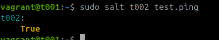
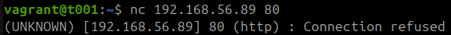

18.41 Asennetaan apache -paketti minionille
                $minion sudo apt update
                $minion sudo apt install apache2
                $minion sudo systemctl enable apache

Sain virheen koska olin käyttänyt väärää nimeä daemonia käynnistettäessä: Failed to enable unit: Unit file apache.service does not exist. Käytin oikeaa nimeä ja silloin yhteys toimi masterilta:

                $minion sudo systemctl enable apache2
                $master nc 192.168.56.89 80
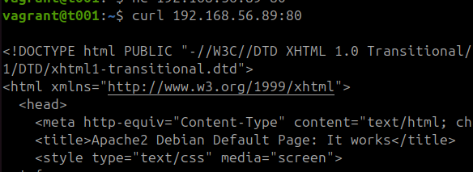  

18.45 Seuraavaksi etsitään apachen konfiguraatiotiedosto  
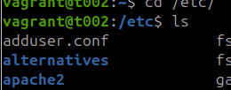
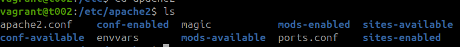

Ja katsotaan mitä sieltä löytyy: 

        $minion sudoedit /etc/apache2/apache2.conf

Tämä oli väärä paikka lähteä liikkeelle. Luin `man apache2` ja `apache2.conf` läpi, mutta näistä ei suoraan näkynyt kansiota, missä verkkosivu on. Muistelin oppitunnilta (Karvinen 2024a) että kansiossa `var` olisi jotain. `var/apache`a ei löytynyt joten menin ja katsoin `var` -kansiota. Sieltä löytyi `www/html` sekä lopulta oikea `index.html` tiedosto. Muokkasin tiedostoa ja testasin näkyikö muutos masterilla:  

        $minion echo "hello world" | sudo tee index.html  

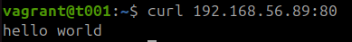

Seuraavaksi purin lokaalin minionin konfiguraation (Komentoon apua lähteestä `apt --help`)  

        sudo apt remove --purge apache2 
        sudo rm -r www

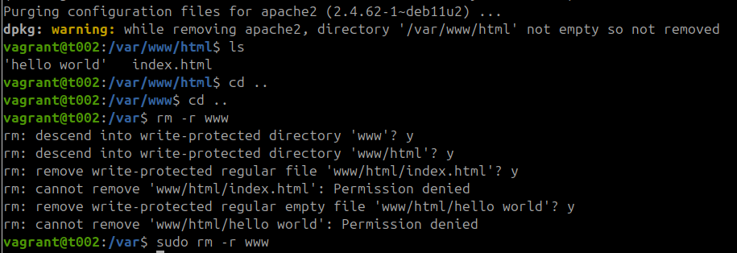

Sitten tein saman tilafunktiolla lokaalisti. Menin ja tein sellaisen: 

                $minion sudo mkdir -p /srv/salt/apache
                $minion sudoedit /srv/salt/apache/init.sls
                        apache2
                          pkg.installed

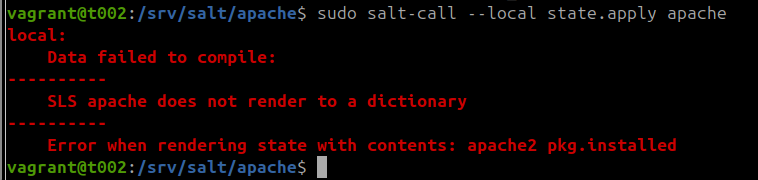

Minulta puuttui `:`, joten se piti vielä lisätä tiedostoon. Sitten tilan ajaminen onnistui. Seuraavaksi muokkasin apachen oletussivustoa

                apache2:
                  pkg.installed
                /var/www/html/index.html:
                  file.managed:
                    - source: salt://srv/salt/apache/index.html

Ja loin index.html -tiedoston, mitä tila hyödyntää:

                $minion echo "hello world" | sudo tee -p /srv/salt/apache/index.html 
                $minion nano /srv/salt/apache/index.html 

19.16. Kokeilin ajaa tilafunktion mutta sain virheen:  
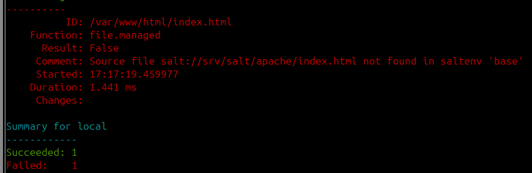  

Oli vaikeaa sanoa mistä tämä johtui. Voi olla että käytin `file.managed` `source` parametria väärin tai sitten sitä ei voi käyttää lokaalisti. Kokeilin sen sijasta paikallista lähdettä, mikä toimi

                - source: /srv/salt/apache/index.html

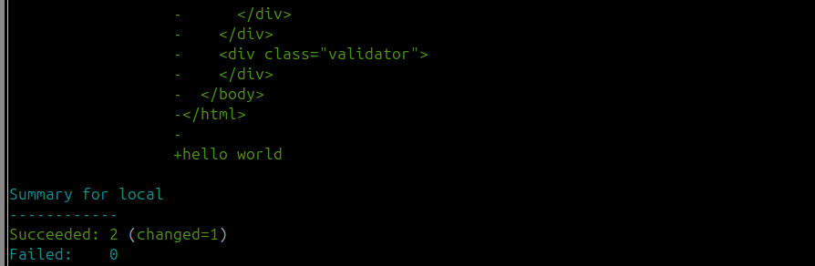

Lopuksi vielä lisätään järjestelmän uudelleenkäynnistys tilafunktioon.

                apache2:
                  pkg.installed
                /var/www/html/index.html:
                  file.managed:
                    - source: salt://srv/salt/apache/index.html
                apache2:
                  - service.running   

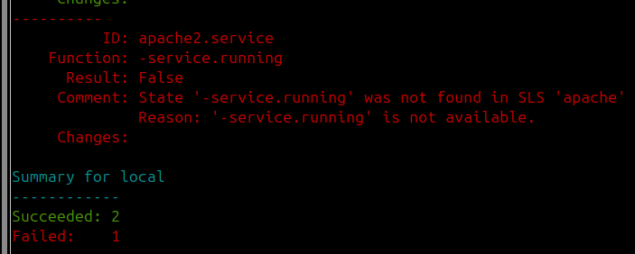  

Koska tuosta tuli virhe, piti muuttaa palvelun nimeä `apache2.service`  

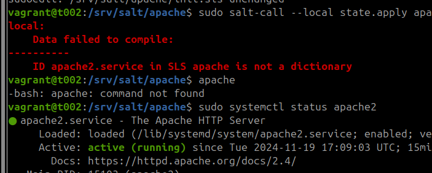  
Lisäsin vielä välilyönnin `-` jälkeen

Tajusin kuitenkin lueskellessani muistiinpanoja tehtävästä että eihän tuo service.running ole lista -muotoinen niinkuin tuo virhekin sanoo. Olisi tokli selkeämpää jos virhe olisi muotoa "should be a dictionary, instead saw list" eikä "is not a dictionary". Tämän muutoksen jälkeen homma lähti pyörimään komennolla `sudo salt-call --local state.apply apache`.

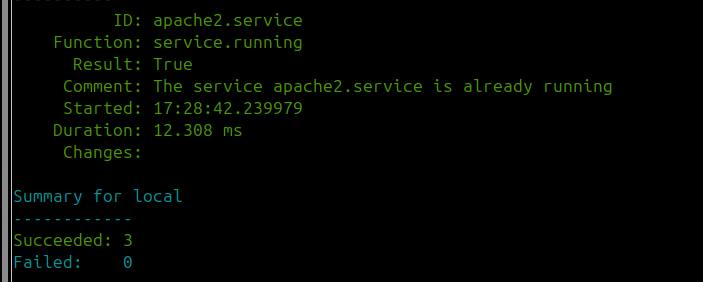

Sitten puretaan koko homma taas. Yritin tässä ensin poistua www- kansiosta jos se sitten poistuisi, mutta jouduin kuitenkin poistamaan kansion erikseen.

                $minion cd ~
                $minion sudo apt remove apache2 --purge
                $minion sudo rm -r /var/www
                $minion sudo rm -r /srv/salt/apache

19.36 Luodaan master -koneella sama tilafunktio eri sourcella:

                $master sudo mkdir -p /srv/salt/apache
                $mastersudoedit /srv/salt/apache/init.sls

   
init.sls:

                apache2:
                  pkg.installed
                /var/www/html/index.html:
                  file.managed:
                    - source: salt://srv/salt/apache/index.html
                apache2.service:
                  service.running  

Kokeilu:

                $master sudoedit /srv/salt/apache/index.html
                        hello world
                $master sudo salt '*' state.apply apache
                
En nähtävästi osannut käyttää tuota sourcea, sillä taas tuli virheviesti siitä ettei tiedostoa löytynyt. Tiedosto  kuitenkin oli  polussa `/srv/salt/apache/index.html`

19.59 Otin selvää aiheesta aluksi salt-callin manuaalista sekä saltin dokumentaatiosivuilta (Salt Project 2024).  Lopulta ChatGPT osasi ohjata minut oikeaan suuntaan kertomalla, että saltin konffeissa määritellään polku, josta tiedostoja lähdetään hakemaan. Eli polut eivät ole absoluuttisia. Tällä ohjeella sain tilan toimimaan:  

                $master sudoedit /srv/salt/apache/index.html
                        - source: salt://apache/index.html
                $master sudo salt '*' state.apply apache
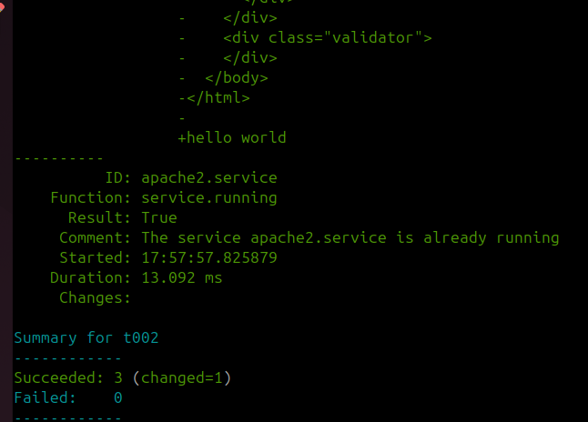

Lopulta testasin tilaa curlilla, mutta siitä unohtui ottaa kuva :)
## b) Asenna SSH koneelle
20.48 Kävinpä saunassa välissä. Edellisessä tehtävässä meni niin kauan, että päätin vähän suoraviivaistaa tekemistä.  Lähdin siis luomaan uutta porttia ssh-serveriin.

        $master nc 192.168.56.89 22
        $master nc 192.168.56.89 8022  

Ensimmäinen onnistui mutta jälkimmäinen ei.

20.48. Muokkasin minionissa paikallisesti ssh -asetukset

        $minion sudoedit /etc/ssh/sshd_config
                Port: 22
                Port: 8022
        $minion sudo systemctl restart sshd 

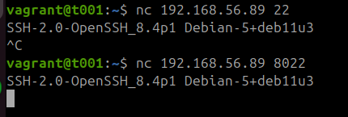  
Lopuksi vielä poistin nämä muutokset minionilta

        $minion sudoedit /etc/ssh/sshd_config
                Port: 22
        $minion sudo systemctl restart sshd 

20.58 Seuraavaksi lähdin tekemään samaa master-slave arkkitehtuurilla.

        $master sudo mkdir -p /srv/salt/sshd
        $master sudoedit  /srv/salt/sshd/init.sls
                /etc/ssh/sshd_config:
                  file.managed:
                    - source: salt://ssh/sshd_config
                sshd:
                  service.running:
                    - watch:
                      - file: /srv/ssh/sshd_config

        #Piti tarkistaa oletusasetukset
        $minion grep -v "#" sshd_config | grep -v "^$"

        $master sudoedit  /srv/salt/sshd/sshd_config
                Include /etc/ssh/sshd_config.d/*.conf
                Port 22
                PasswordAuthentication no
                ChallengeResponseAuthentication no
                UsePAM yes
                X11Forwarding yes
                PrintMotd no
                AcceptEnv LANG LC_*
                Subsystem	sftp	/usr/lib/openssh/sftp-server
                ClientAliveInterval 120
                UseDNS no

En muistanut mikä oli line ending kun laadin grep -komentoa, mutta apu löytyi StackOverflowsta kiitos Ray'n (2024) kommentin niin katoin Ray:n kommenttia. Avusta huolimatta sain virheen taasliittyen polkuihin:

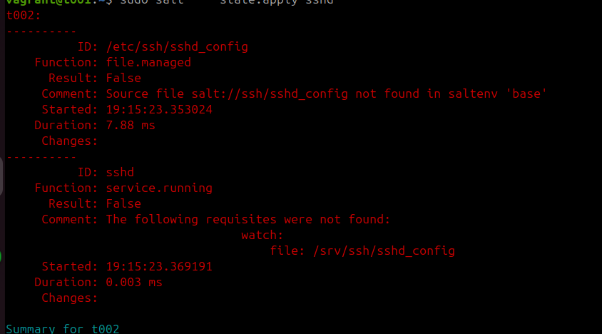

Muokkasin init.sls -tiedostoa seuraavasti:
        
        - source: salt://sshd/sshd_config

        - file: /etc/ssh/sshd_config  

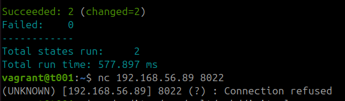

21.15 Yllä olevasta logista näkyi että portti ei ollut auki. Olinkin unohtanut vielä lisätä asetustiedostoon portin 8022. Lisäsin portin masterilla tiedostoon `/serv/salt/sshd/sshd_config`, mikä auttoi

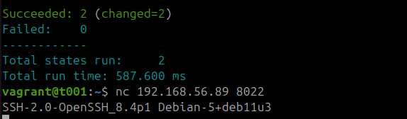  

## c) Rakenna oma Demonia hyödyntävä moduuli
Jätin tämän tehtävän viimeiseksi. Ehdin yhden lähteen katsoa aiheeseen liittyen. Nyt pitää kuitenkin tehdä muita hommia.
https://stackoverflow.com/questions/38956127/usb-device-is-not-visible-inside-vagrant
## d) Konfiguroi VirtualHost
20.11.2024 06.03 Tässä kohtaa minionilla oli niin sshd kuin apache. Päätin tuhota virtuaalikoneet ja pistää ne uudestaan käyntiin. Tällä kertaa muokkasin vagrant -tiedostoa niin, että se automaattisesti konfiguroi saltin minionille ja masterille. Lisäsin nämä rivit koodiin ja toistin asennuskomennot. Käytin myös virtuualikoneiden sisällä komentoa `vm.provision` (Hashicorp 2024):

                t001.vm.provision "shell", inline: $master

                t002.vm.provision "shell", inline: $minion

Muutaman syntaksivirheen korjattuani ja muistettuani pistää apt-get installiin parametriksi -y, sain koneet toimimaan uudella Vagrantfile -tiedostolla. Tiedosto löytyy git-repositoriosta.  
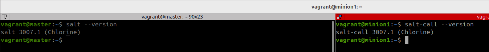

07.20 Välissä on nyt syöty aamupala ja lenkitetty koira. Nyt aloitetaan virtuaalihostin luonti. Tarvitaan apacheen moduuli

        $master sudo mkdir -p /srv/salt/apache2
        $master sudoedit  /srv/salt/apache2/init.sls
                apache2:
                  pkg.installed
                apache2.service:
                  service.running

07.22 Sitten luodaan käyttäjämoduuli. Tässä luettiin vielä lisää salt-callin dokumentteja. Salasanan hashaykseen apua Stackoverflowsta (Acdcjunior 2024)   

        $master sudoedit  /srv/salt/user/init.sls
        $master echo -n password | sha256sum
        $master sudoedit  /srv/salt/user/init.sls
        $master sudo salt '*' state.apply user

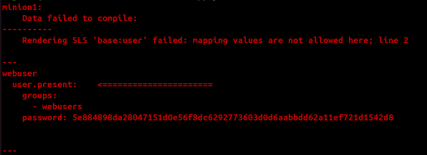  

Korjasin tiedostoon `:`, mikä tuotti virheen:

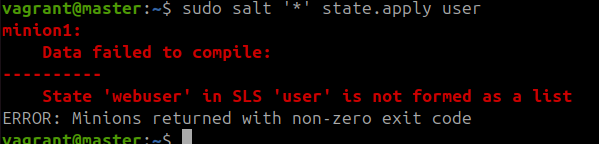

Muutin user.presentin parametrit listaksi, mikä tuotti virheen:  

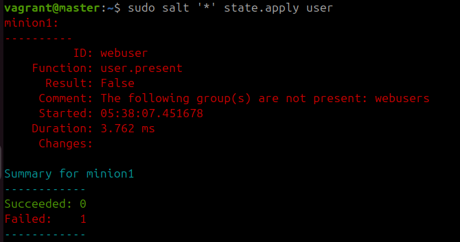

Unohdin luoda ryhmän ja lopullinen onnistunut init.sls:

        webusers:
          group.present
        webuser:
          user.present:
            - groups:
              - webusers
            - password: 5e884898da28047151d0e56f8dc6292773603d0d6aabbdd62a11ef721d1542d8

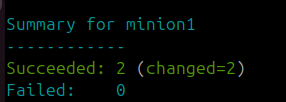

07.53 Seuraavaksi muokkasin apache2-moduulia ja loin index.html käyttäjän public_html -kansioon käyttäjän oikeuksilla
                        
                apache2:
                  pkg.installed
                ~/public_html/index.html:
                  file.managed:
                    - source: salt://srv/salt/apache2/index.html
                    - user: webuser
                apache2.service:
                  service.running

Ja luodaan tiedosto
        
        $master sudoedit  /srv/salt/apache2/index.html
                hello world

Taas polut vihoittelee minulle, olin kopioinut konfiguraation vanhasta raportin osasta.

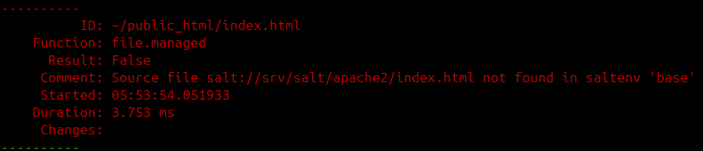

         - source: salt://apache2/index.html
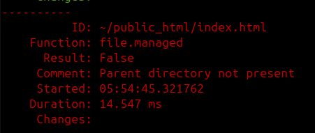

Manuaaleista löysin parametrin:

    - makedirs: True

Tiedostoja ei kuitenkaan löytynyt, ja saltin komennosta näkyi että ne olivat menneet roottiin. Korvasin polun  `~` polulla 
`home/webuser/public_html/index.html`. Tämä toi tiedostot oikeaan paikkaan, mutta muokkausoikeutta  käyttäjällä ei ollut:

        $minion nano /home/webuser/public_html/index.html

Ilmeisesti tiedoston omistajuus ei riittänyt, ja siksi ajattelin lähteä muokkaamaan kansion oikeuksia. Tajusin kuitenkin nopeasti että olin kirjautunut vagrant -käyttäjällä, en webserver käyttäjällä. Käyttäjälle webserver kirjautuminen ei onnnistunut.

         $minion su webserver

Saltin user -manuaali ohjeistaa luomaan salasanan komennolla `mkpasswd -m sha-256` Ja sieltä tulikin eri hashi. `mkpassword` on osa whois -pakettia (Chucknemeth 2024).

        $master sudo apt install whois
        $master mkpasswd -m sha-256
        $master sudoedit srv/salt/user/init.sls
            - password: $5$XXadIO8t/joqnpRm$YqZVu1WdmK7GzN98sRjJ0S8MKxIs7RbQZ4Lk2y3v0Y5  

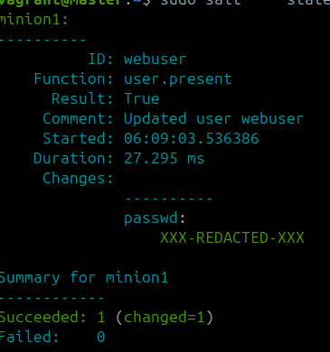

Nyt onnistui myös sivuston kirjoittaminen asianmukaisilla oikeuksilla  

        $webserver nano public_html/index.html
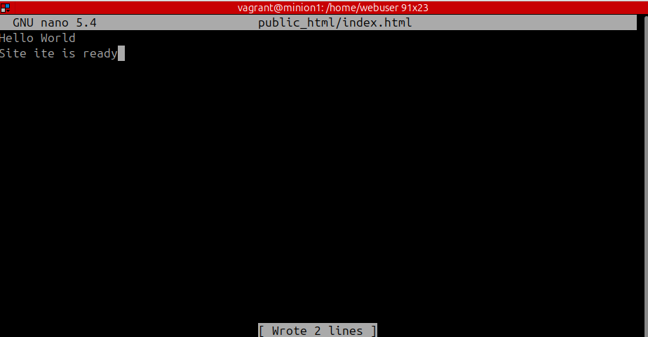

Vielä olisi konfiguroitava apache tarjoamaan tätä kyseistä sivustoa. Lähdin tällaisella liikkeelle:

        $minion grep -v '#' /etc/apache2/apache2.conf | grep -v '^$'
        $master sudoedit  /srv/salt/apache2/init.sls
                <Directory /home/webuser/public_html/>

Sitten vcähän hidastin vauhtia ja luin mitä Apachen default sivulla lukee:

        By default, Debian does not allow access through the web browser to
        <em>any</em> file apart of those located in <tt>/var/www</tt>,
        The default Debian document root is <tt>/var/www/html</tt>. You
        can make your own virtual hosts under /var/www.

Eli päätinkin ratkaista tehtävän  eri tavalla, ja luomalla linkin `var/www/html/index.html`. Annan oikeudet käyttäjälle tiedostoon ja sijoitan symlinkin `home/webuser/public_html` -kansioon Jätän confitiedoston kuitenkin moduuliin, jos haluan muokata sitä myöhemmin. Tein tällaisen sls -tiedoston:

        apache2:
          pkg.installed
        /srv/www/html/index.html:
          file.managed:
            - source: salt://apache2/index.html
            - user: webuser
            - makedirs: True
        /home/webuser/public_html:
          file.symlink:
            - target: /srv/www/html/index.html
            - makedirs: True
            - user: webuser
        /etc/apache2/apache2.conf:
          file.managed:
            - source: salt://apache2/apache2.conf
        apache2.service:
          service.running
Ja sain ihan uuden virheen:

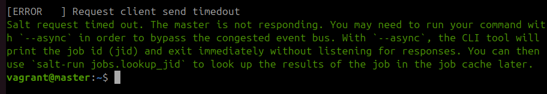

Kokeilin poistaa toiminnallisuuksia .sls -tiedostosta yhden tilafunktion kerrallaan, eikä mikään toiminut enään. Tein myös komennot:

        $master sudo salt-key -L
        $master sudo salt '*' test.ping
        $master nc 192.168.56.89 22
Minionin avain oli kyllä reksiteröitynä mutta mikään tilafunktio, edes test.ping ei enään mennyt läpi.  Ajattelin käynnistää vmmät uudestaan uudella vagrantfilellä

Nyt vmmillä on myös raportin mukaiset nimet ja skannasin avaimet masterilla ja loin user .moduulin uudestaan.

        vagrant@master:~$ sudo salt-key -A
        vagrant@master:~$ sudo mkdir -p  /srv/salt/user && sudoedit /srv/salt/user/init.sls

        webuser:
          user.present:
            - password: 5e884898da28047151d0e56f8dc6292773603d0d6aabbdd62a11ef721d1542d8

Tämän jälkeen apachemoduuli:

        vagrant@master:~$  sudo mkdir -p  /srv/salt/apache2 && sudoedit /srv/salt/apache2/init.sls

        apache2:
          pkg.installed
        /home/webuser/public_html:
          file.symlink:
            - target: /var/www/html/index.html
            - makedirs: True
            - user: webuser
        /etc/apache2/apache2.conf:
          file.managed:
            - source: salt://apache2/apache2.conf
        apache2.service:
          service.running

Ja apachen asetukset:

        vagrant@master:~$ sudoedit /srv/salt/apache2/apache2.conf

        DefaultRuntimeDir ${APACHE_RUN_DIR}
        PidFile ${APACHE_PID_FILE}
        Timeout 300
        KeepAlive On
        MaxKeepAliveRequests 100
        KeepAliveTimeout 5
        User ${APACHE_RUN_USER}
        Group ${APACHE_RUN_GROUP}
        HostnameLookups Off
        ErrorLog ${APACHE_LOG_DIR}/error.log
        LogLevel warn
        IncludeOptional mods-enabled/*.load
        IncludeOptional mods-enabled/*.conf
        Include ports.conf
        <Directory />
                Options FollowSymLinks
                AllowOverride None
                Require all denied
        </Directory>
        <Directory /usr/share>
                AllowOverride None
                Require all granted
        </Directory>
        <Directory /var/www/>
                Options Indexes FollowSymLinks
                AllowOverride None
                Require all granted
        </Directory>
        AccessFileName .htaccess
        <FilesMatch "^\.ht">
                Require all denied
        </FilesMatch>
        LogFormat "%v:%p %h %l %u %t \"%r\" %>s %O \"%{Referer}i\" \"%{User-Agent}i\"" vhost_combined
        LogFormat "%h %l %u %t \"%r\" %>s %O \"%{Referer}i\" \"%{User-Agent}i\"" combined
        LogFormat "%h %l %u %t \"%r\" %>s %O" common
        LogFormat "%{Referer}i -> %U" referer
        LogFormat "%{User-agent}i" agent
        IncludeOptional conf-enabled/*.conf
        IncludeOptional sites-enabled/*.conf

Lopuksi top.sls tiedosto:

        vagrant@master:~$ sudoedit /srv/salt/top.sls
                         
        base:
          '*':
            - user
            - apache2      

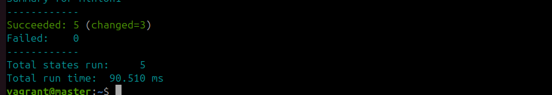

Meni niin näppärästi että alkoi tuntumaan että tämähän sujuu hyvin. Pääsin nyt tutkimaan miten symlink oikein toimii. Menin minionille ja näin että kansio on punainen eikä siitä saanut mitään ulos:

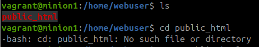

Muutin seuraavan rivin symlink funktiosta:

    - target: /srv/www/html 

Vielkin kansio oli punaisella. Huomasin että olin käyttänyt väärää kansiota `srv`. Täytyy opetella nämä kansion nimet että mistä mikäkin tulee, sillä on todella vaikeaa muistaa kansioiden merkityksiä kirjainlyhenteiden pohjalta. 

    - target: /var/www/html/index.html

En onnistunut enää kirjautumaan käyttäjälle webuser, sillä siellä oli vielä vaarällä hash -komennolla tehty salasana, piti muokata salasana:

        vagrant@master:~$ sudo apt install whois
        vagrant@master:~$ mkpasswd -m sha-256

Tajuisin tässä kohtaa että kun kopioin raportista aikaisempia rivejä, toistan mahdollisesti niissä tapahtuneet virheet. Ongelma tulee siitä, että jos raportissa ei muokkaa jälkikäteen sitä mitä on tehty, virheelliset tiedot jäävät sinne. Sitten juuri käy näin että kun kopioi edellisä komentoja niin sieltä sitten kopioi yhden pykälän liian vanhan komennon ja koko homma kaatuu. Täytyy keksiä tähän joku ratkaisu.

No, muutin salasanan hashin user -moduuliin ja pääsin kirjautumaan käyttäjälle. Vieläkin oikeudet olivat väärin.

        $webuser nano public_html/index.html

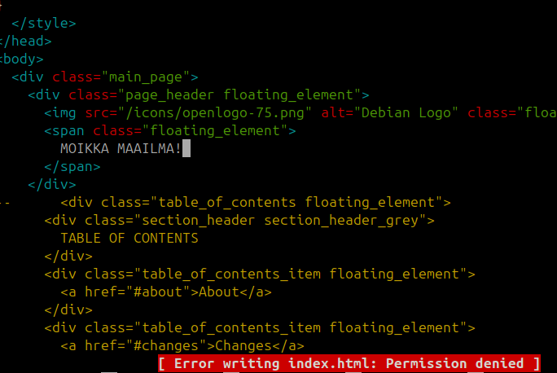

Täytyy antaa varmaan oikeudet kansioon, mitä symlink ei anna. Luin taas saltin manuaaleja symlinkistä. Lisäsin kolme uutta riviä apache -moduuliin. Nämä antavat käyttäjälle oikeuden koko html kansioon. 

        /var/www/html:
          file.directory:
            - user: webuser

Edelleen tuli permission denied. Luin manuaaleja ja lisäsin dile.directory - funktioon `recurse` paramterin. Unohdin tallentaa linkin, mistä löysin apua tähän tilanteeseen. Muistaakseni en kuitenkaan keksinyt tätä itse. Lopullinen apache2 -moduuli:

        apache2:
          pkg.installed
        /home/webuser/public_html:
          file.symlink:
            - target: /var/www/html
            - makedirs: True
            - user: webuser
        /etc/apache2/apache2.conf:
          file.managed:
            - source: salt://apache2/apache2.conf
        apache2.service:
          service.running
        /var/www/html:
          file.directory:
            - user: webuser
            - recurse:
                - user

Lopullinen user -moduuli:

        webuser:
          user.present:
            - password: $5$XXadIO8t/joqnpRm$YqZVu1WdmK7GzN98sRjJ0S8MKxIs7RbQZ4Lk2y3v0Y5

09.31 Ja homma pelitti komennolla:

        vagrant@master:~$ curl 192.168.56.89

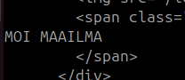

Mitä opin:
- Jos haluaa aina testata pienimmän mahdollisen toimivan osasen, raportointiin menee paljon aikaa. 
- Olen huolimaton, tässä ei mitään uutta (I <3 typescript)
- Kun ei muokkaa aikaisempia virheitä raporttiin, tekee nämä virheet jossain kohti uudestaan. On siis raportoinnin lisäksi pidettävä omalla koneella esim notepadissa aina viimeisimpiä onnistuneita komentoketjuja tallella.
- Ratkaisu on nyt sikäli huono, jos haluaisi luoda uuden käyttäjän ja sille oman verkkosivun, tämä konffaus ei nyt salli sitä. webuserilla on oikeudet koko html -kansioon, eikä joka käyttäjällä ole omaa verkkosivukansiotaan. Toisaalta en ollut varma olisiko tällainen shared host tyyppinen aspekti edes pitänyt ottaa huomioon.

## e) Vapaaehtoinen
## f) Vapaaehtoinen
## g) Vapaaehtoinen

## Lähteet
Karvinen, Tero 2024a. Palvelinten Hallinta - Configuration Management Systems course - 2024 autumn. Lähde: https://terokarvinen.com/palvelinten-hallinta/ (Luettu 2024.11.06)  
Karvinen, Tero 2006. Raportin kirjoittaminen – Salt Stack Master and Slave on Ubuntu Linux. Lähde: https://terokarvinen.com/2006/06/04/raportin-kirjoittaminen-4/ (Luettu 28.10.2024)  
Karvinen, Tero 2018. Pkg-File-Service – Control Daemons with Salt – Change SSH Server Port. Lähde: https://terokarvinen.com/2018/04/03/pkg-file-service-control-daemons-with-salt-change-ssh-server-port/?fromSearch=karvinen%20salt%20ssh (Luettu: 15.11.2024)
Wikipedia 2024. Daemon (Computing). lähde: https://en.wikipedia.org/wiki/Daemon_(computing) (Luettu 15.11.2024)
Salt Project 2024. salt.states.file - Operations on regular files, special files, directories, and symlinks. Lähde: https://docs.saltproject.io/en/latest/ref/states/all/salt.states.file.html (Luettu 15.11.2024)  
Ray 2024. Grep for beginning and end of line?. Lähde: https://stackoverflow.com/questions/4800214/grep-for-beginning-and-end-of-line (Luettu: 19.11.2024)
Hashicorp 2024. Basic Usage of Provisioners. Lähde: https://developer.hashicorp.com/vagrant/docs/provisioning/basic_usage (Luettu: 20.11.2024)  
Acdcjunior 2024. Generating a SHA-256 hash from the Linux command line. (https://stackoverflow.com/questions/3358420/generating-a-sha-256-hash-from-the-linux-command-line) (Luettu 20.11.2024)  
Chucknemeth 2024. mkpasswd. Lähde: (https://wiki.chucknemeth.com/linux/security/password/mkpasswd) (Luettu: 20.11.2024)
## Käytettyjen laitteiden tekniset tiedot

Asus ROG Strix GT15

-   Suoritin: Intel® Core™ i5-10400F -6-ydinsuoritin, 2,9-4,3 GHz, 12 Mt välimuisti
-   Piirisarja: Intel® B460
-   Keskusmuisti: 16 Gt DDR4 2933 MHz
-   Tallennustila: 512 Gt M.2 NVMe PCIe 3.0 SSD
-   Näytönohjain: NVIDIA® GeForce® GTX 1660 6GB (1x HDMI, 1x DP, 1 x DVI)
-   Ääni: SupremeFX S1220A Codec
-   Verkko: Gigabit Ethernet, Intel WiFi 6 (802.11ax), Bluetooth 5.0
-   Käyttöjärjestelmä: Windows 10 Home 64-bit

Tätä dokumenttia saa kopioida ja muokata GNU General Public License (versio 2 tai uudempi) mukaisesti. http://www.gnu.org/licenses/gpl.html

Pohjautuu Palvelinten hallinta -kurssin tehtävään: https://terokarvinen.com/palvelinten-hallinta/