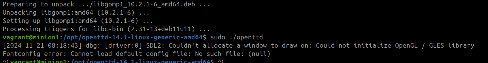

Tein vahingossa ensimmäisen osan tehtävän jo edellisellä viikolla. Alla tuotos.

## Rakenna oma Demonia hyödyntävä moduuli
Jätin tämän tehtävän viimeiseksi. Piti tehdä jotain ääniin liittyvää, mutten ehtinyt ottamaan enempää selvää laitteiden kytkemisestä vagra virtuaalikoneisiin. Tutkiskelin siitä jotain tekstejä ja kokeilin usb -laitteiden liittämistä, mutta projekti näytti aika haastavalta. Yritän siis tehdää OpenTTD -peliserverin minion koneelle moduulilla.

21.11.2024 9.24 Tuhosin ja aloitin alusta virtuaalikoneet   

    $ sudo vagrant destroy
    $ sudo vagrant up
    $ sudo vagrant ssh master
    $ sudo vagrant ssh minion1
    vagrant@master:~$ sudo salt-key -A

Tässä taikurin hihat:

 

Lähdin ottamaan selvää miten tämä asennus voisi onnistua. Openttd Linux paketti löytyi verkosta, mutta en tiedä miten siihen käytetään tätä avainsysteemiä. Ylipäätään vähän mysteeri, miten avainten hallinta toimii kun käyttää `pkg.installed: curl` esimerkiksi. Päättelisin että tässä tilanteessa pitäisi eka antaa aptille tietoja ja pääädyin kokeilemaan pkgrepo.managed -tilafunktiota. Apua saltin dokumenteista (Salt Project 2024b, 2024c).

    vagrant@master:~$ sudo mkdir -p  /srv/salt/openttd
    vagrant@master:~$ sudoedit /srv/salt/openttd/init.sls
    vagrant@master:~$ sudo salt '*' state.apply openttd

En ymmärtänyt tuota environment variablea base, ja mietin että pitääpä kysyä tunnilla. Korjauksen jälkeen tiedosto init.sls oli tällainen:

    pkgrepo.managed:
      - humanname: openttd repo
      - mirrorlist: https://cdn.openttd.org/openttd-releases/14.1/openttd-14.1-linux-generic-amd64.tar.xz
      - gpgcheck: 1
      - key_text: c7648c9aac11daeb7f1bdd7a07346865ae590c07af4a6d02a5ed>

Lisäsin pkgmanagelle name -attribuutin:

    openttd:
      pkgrepo.managed

Kokeilin laittaa ID:ksi asennusosoitteen:

No, olin nyt aivan hukassa. En tiennyt mitä tilafuntkiota edes seuraavaksi lähtisi katsomaan. Tämä pakettien asentamienn ja avainten tsekkaaminen on jotenkin tuntunut aika monimutkaiselta asialta oppia. Siihen on aina joku oma jipponsa. Katsoin ChatGPT:ltä apua ja se ohjasi näin:

    openttd:
      file.managed:
        - name: /tmp/openttd-14.1-linux-generic-amd64.tar.xz
        - source: https://cdn.openttd.org/openttd-releases/14.1/openttd-14.1-linux-generic-amd64.tar.xz
        - source_hash: sha256=c7648c9aac11daeb7f1bdd7a07346865ae590c07af4a6d02a5ed01fb33eba067

Nyt kun pandoran lipas oli avattu, ja aikaa rajallisesti (tunti enää ja tänään on torstai), jatkoin ChatGPT:n viitoittamalla tiellä, jonka se oli laskenut eteeni samalla kun oli neuvonut paketin lataamisessa. Asensin lataustiedostosta openttd ohjelman:

    vagrant@minion1:~$ tar -xJf /tmp/openttd-14.1-linux-generic-amd64.tar.xz -C /opt  

Vaikka toiminto toimi minionilla, ei chatGPT:n ohje toiminut minulla tilafunktiossa. ChatGPT oli laittanut cmd.runin openttd -idn alle, joten muutin sitä. Alla ChatGPT:n ehdotuksen jälkeen myös oma versioni, joka toimi

    vagrant@master:~$ sudoedit /srv/salt/openttd/init.sls
    #ChatGPT:n ohje
      openttd:
        file.managed:
          - name: /tmp/openttd-14.1-linux-generic-a>
          - source: https://cdn.openttd.org/openttd>
          - source_hash: sha256=c7648c9aac11daeb7f1>  
        cmd.run:
            - name: |
                tar -xJf /tmp/openttd-14.1-linux-generic-amd64.tar.xz -C /opt
            - unless: test -d /opt/openttd-14.1

    #oma versio
    openttd:
      file.managed:
        - name: /tmp/openttd-14.1-linux-generic-a>
        - source: https://cdn.openttd.org/openttd>
        - source_hash: sha256=c7648c9aac11daeb7f1>
    tar -xJf /tmp/openttd-14.1-linux-generic-amd6>
      cmd.run:
        - unless: test -d /opt/openttd-14.1

Menin seuraavaksi tutkimaan minionilla mitä sieltä oli avautunut. Tällöin voisin lähteä käynnistämään daemonia.

latasin libgomp.so.1:sen mikä onneksi löytyi pakettikirjastosta suoraan. Koska lataus näin onnistui, lisäsin sen myös suoraan moduuliin ja testasin. 

    vagrant@minion1:~$ sudo apt-get install -y libgomp1
    vagrant@master:~$ sudoedit /srv/salt/openttd/init.sls
        libgomp1:
          pkg.installed

Yhteenvedosta myös huomasi että cmd -komento ei ole vielä idempotentti, joten muutin sitä osaa tilafunktiosta (apuna saltin dokumentit):

    vagrant@master:~$ sudoedit /srv/salt/openttd/init.sls
      cmd.run:
        - creates: /opt/openttd-14.1-linux-generic-amd64

Kokeilin vielä viimeistä ChatGPT:n antamaa ohjetta liittyen symlinkkiin. En aluksi tajunnut mikä se oli, mutta tässä kohtaa tuli jonkinlainen haju kun `openttd` ei toiminut suoraan komentorivin komentona. Tulipa opittua samalla miten PATH "ympäristömuuttujia" linuxissa tehdään manuaalisesti. Tämä ChatGPT:ltä poimittu pätkä siis lisäsi `openttd` komentotyökaluun. Jouduin sitä muuttamaan targetin osalta, minkä ChatGPT oli määritellyt väärin:    

    /usr/local/bin/openttd:
    file.symlink:
      - target: /opt/openttd-14.1-linux-generic-amd64/openttd
      - force: True

  

Nyt kun tuo ohjelma toimi, oli aika tutkia miten openttd dedicated serveri käynnistettiin linuxilla. Apua wikistä (Openttd 2024). Harmi että olin kadottanut vanhan confitiedostoni, jota olin käyttänyt windowsilla. Tein seuraavat komennot ja yritin samalla ottaa selvää mikä käynnistyvän demonin nimi on.

    openttd -D
    systemctl status openttd
    sudo ps aux

Openttd --help neuvoi käynnistämään palvelun parametrillä `-D [host][:port]    = Start dedicated server`

 Ja seuraavaksi olisi tehtävä nämä konfiguraatiot luomalla moduuliin `Openttd.cfg` tiedosto, lataamalla se salt-minionille `file.managed` -tilafunktiolla ja uudelleenkäynnistettävä demoni. 

    Set Lan internet to 0.
    Change Server name so you can identify the server,
    Set Server advertise to true, so it will be visible on the Server list
    If you have multiple network interfaces make sure you set Server bind ip.
    If you are behind a router, make sure that you forward the port specified by Server port (both TCP and UDP) 

10.39 Alla lopputilanne:

## Lähteet
Karvinen, Tero 2024a. Palvelinten Hallinta - Configuration Management Systems course - 2024 autumn. Lähde: https://terokarvinen.com/palvelinten-hallinta/ (Luettu 2024.11.06)  
Karvinen, Tero 2006. Raportin kirjoittaminen – Salt Stack Master and Slave on Ubuntu Linux. Lähde: https://terokarvinen.com/2006/06/04/raportin-kirjoittaminen-4/ (Luettu 28.10.2024)  
Karvinen, Tero 2018. Pkg-File-Service – Control Daemons with Salt – Change SSH Server Port. Lähde: https://terokarvinen.com/2018/04/03/pkg-file-service-control-daemons-with-salt-change-ssh-server-port/?fromSearch=karvinen%20salt%20ssh (Luettu: 15.11.2024)
Wikipedia 2024. Daemon (Computing). lähde: https://en.wikipedia.org/wiki/Daemon_(computing) (Luettu 15.11.2024)
Salt Project 2024. salt.states.file - Operations on regular files, special files, directories, and symlinks. Lähde: https://docs.saltproject.io/en/latest/ref/states/all/salt.states.file.html (Luettu 15.11.2024)  
Salt Project 2024b. salt.states.pkg. Lähde: https://docs.saltproject.io/en/latest/ref/states/all/salt.states.pkg.html (Luettu 21.11.2024)  
Salt Project 2024c. salt.states.pkgrepo. Lähde: https://docs.saltproject.io/en/latest/ref/states/all/salt.states.pkgrepo.html (Luettu 21.11.2024)  
Ray 2024. Grep for beginning and end of line?. Lähde: https://stackoverflow.com/questions/4800214/grep-for-beginning-and-end-of-line (Luettu: 19.11.2024)
Hashicorp 2024. Basic Usage of Provisioners. Lähde: https://developer.hashicorp.com/vagrant/docs/provisioning/basic_usage (Luettu: 20.11.2024)  
Acdcjunior 2024. Generating a SHA-256 hash from the Linux command line. (https://stackoverflow.com/questions/3358420/generating-a-sha-256-hash-from-the-linux-command-line) (Luettu 20.11.2024)  
Chucknemeth 2024. mkpasswd. Lähde: (https://wiki.chucknemeth.com/linux/security/password/mkpasswd) (Luettu: 20.11.2024)  
Openttd 2024: https://wiki.openttd.org/en/Manual/Dedicated%20server (Luettu 21.11.2024)  

## Käytettyjen laitteiden tekniset tiedot

Asus ROG Strix GT15

-   Suoritin: Intel® Core™ i5-10400F -6-ydinsuoritin, 2,9-4,3 GHz, 12 Mt välimuisti
-   Piirisarja: Intel® B460
-   Keskusmuisti: 16 Gt DDR4 2933 MHz
-   Tallennustila: 512 Gt M.2 NVMe PCIe 3.0 SSD
-   Näytönohjain: NVIDIA® GeForce® GTX 1660 6GB (1x HDMI, 1x DP, 1 x DVI)
-   Ääni: SupremeFX S1220A Codec
-   Verkko: Gigabit Ethernet, Intel WiFi 6 (802.11ax), Bluetooth 5.0
-   Käyttöjärjestelmä: Windows 10 Home 64-bit

Tätä dokumenttia saa kopioida ja muokata GNU General Public License (versio 2 tai uudempi) mukaisesti. http://www.gnu.org/licenses/gpl.html

Pohjautuu Palvelinten hallinta -kurssin tehtävään: https://terokarvinen.com/palvelinten-hallinta/