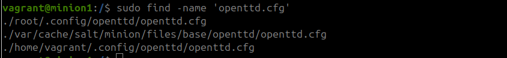
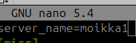
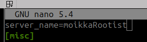

/tmp/openttd-14.1-linux-generic-amd64.tar.xz:
  file.managed:
    - source: salt://openttd/openttd-14.1-linux-generic-amd64.tar.xz
tar -xJf /tmp/openttd-14.1-linux-generic-amd64.tar.xz -C /opt:
  cmd.run:
    - creates: /opt/openttd-14.1-linux-generic-amd64
/usr/local/bin/openttd:
  file.symlink:
    - target: /tmp/openttd-14.1-linux-generic-amd64/openttd
    - force: True
libgomp1:
  pkg.installed
openttd -Df localhost:3001:
  cmd.run


  graiikkojen checksum:
  928fcf34efd0719a3560cbab6821d71ce686b6315e8825360fba87a7a94d7846

## OpenTTD -infra koodina
Projektin tarkoituksena oli tuottaa koodi, joka rakentaa openTTD -pelipalvelimen kohdekoneelle käyttäen hyödyksi Saltstackia. Käyn tässä raportissa läpi kaikki tarvittavat vaiheet. Halusin myös konfiguroida pelin siten, että se toimisi koko viikonlopun pituisena marathon -pelinä, jota voisi pelata muiden lanien pelien yhteydessä.

7:45 Aloitin tehtävän tekemisen.

Loin kaksi vagrant -virtuaalikonetta **master** ja **minion1** seuraavilla alkuskripteillä:
```sh
# Copyright 2019-2021 Tero Karvinen http://TeroKarvinen.com
$tscript = <<TSCRIPT
set -o verbose
apt-get update
apt-get -y install tree
apt-get -y install curl
sudo mkdir -p /etc/apt/keyrings
sudo curl -fsSL https://packages.broadcom.com/artifactory/api/security/keypair/SaltProject>
sudo curl -fsSL https://github.com/saltstack/salt-install-guide/releases/latest/download/s>
sudo apt-get update
echo "Done - set up test environment - https://terokarvinen.com/search/?q=vagrant"
TSCRIPT

# Author: Olli
$minion = <<TSCRIPT
sudo apt-get update
sudo apt-get install -y salt-minion
echo "master: 192.168.56.88" | sudo tee /etc/salt/minion
sudo systemctl restart salt-minion
echo "Done - set up minion environment"
TSCRIPT

# Author: Olli
$master = <<TSCRIPT
sudo apt-get update
sudo apt-get install -y salt-master
sudo systemctl restart salt-master
echo "Done - set up minion environment"
TSCRIPT

```


Loin openttd -moduulin saltille master -koneella ja latasin tarvittavat Openttd -tiedostot.

```sh
$vagrant@master sudo mkdir -p /srv/salt/openttd
$vagrant@master cd /serv/salt/openttd
$vagrant@master sudo curl -O https://cdn.openttd.org/openttd-releases/14.1/openttd-14.1-linux-generic-amd64.tar.xz
$vagrant@master sha256sum openttd-14.1-linux-generic-amd64.tar.xz 
```

Asensin Openttd -ohjelman master -koneelle, jotta voisin testata sitä paikallisesti ja saada konfiguraatiotiedostot käyttöön. Asensin ohjelman /opt -kansioon (Hoffman & Gloor 2024)

```sh
$vagrant@master sudo tar -xJf ./openttd-14.1-linux-generic-amd64.tar.xz -C /opt
$vagrant@master sudo cp -s /opt/openttd-14.1-linux-generic-amd64/openttd /usr/local/bin/openttd
$vagrant@master openttd --help
```
openttd: error while loading shared libraries: libgomp.so.1: cannot open shared object file: No such file or directory

```sh
$vagrant@master sudo apt install libgomp.so.1
$vagrant@master openttd --help
$vagrant@master openttd -Df

```
  
  

Katsotaan seuraavkasi mistä voisi löytyä konfiguraatiotiedosto `openttd.cfg`. Käytin komentoja `ls -a`, `find -name 'openttd'` ja lopulta luin openttd sivuilta, että asetustiedosto on kotihakemistossa `~/.config`. Sieltä ei kuitenkaan vielä löytynyt tiedostoa, vaikka kansio oli kyllä olemassa. Ajoin kotihakemistossa `sudo find -name 'openttd.cfg'` Eikö mitään löytynyt. No, käynnistin serverin uudestaan komennolla, jossa otin huomioon portin ja halusin pitääö konsolin auki.
```sh
openttd -D localhost:3001:
```
Ja sain viestin:


Planetmaker osasi kertoa, että openttdtä ei kannattaisi ajaa roottina. Ehkä ohjelma pitäisi asentaa käyttäjälle? https://www.tt-forums.net/viewtopic.php?t=70615

Purin ohjelman kotihakemistoon ja ajoin sieltä ja nyt valitti taas grafiikkasetistä. Jtoain kuitenkin tpaahtui ja yritin komennoilla `ps` ja `top` selvittää oliko ohjelma päällä, mielestäni ei (Ayodeji 2024).


Luin openttd --help komentoa vähän tarkemmin ja olin ainakin laittanut komentoja väärään järjestykseen. Kokeilin seuraavaksi `openttd -f -D localhost:3001`


`ps -x` Ei kuitenkaan näyttänyt vieläkään mitään. Menin kotihakemistoon ja `find -name '*log*'` löysin logitiedoston ja tsekkasin sitä. Noo sama grafiikkaongelma. MEnin lukemaan manuaaleja. Pitäisi varmaan onnistua käynnistämään se ilman graafista liittymää.

No siellähän luki että OpenTTD needs some additional graphics and sound files to run. Eikun asentamaan. Manuaalistä löyty pari ilmaista grafiikkakirjastoa. KAtoin Openttd asennusopasta.

LAtasin grafiikat suoraan moduuliin, koska tarvitsisin niitä myöhemmin openttd kanssa:
```sh
sudo curl -O https://cdn.openttd.org/opengfx-releases/7.1/opengfx-7.1-all.zip'
sha256sum ./opengfx-7.1-all.zip 
tar -xf opengfx-7.1-all.zip -C /tmp/openttdGfx
# Virhe: tar: This does not look like a tar archive
sudo apt install unzip
sudo unzip -q opengfx-7.1-all.zip 
sudo tar -xf opengfx-7.1.tar -C /tmp
```

Sitten menin lukemaan tuon grafiikkasetin manuaaleja. Olen vähn liian hätänen, taria ei tarvitsisi unpackata. `sudo rm -r -f  opengfx-7.1/`


No, laitoin tämän nyt sitten kansioon (koitan nyt ensiksi /opt/ -kansiota) ja sain seuraavan errorin:


Ja kielikansiossa on kyl kamaa...


Ongelma oli komennon laittamisessa temrinaalikomennossa. Kun käynniskin komennon suoraan kansiosta ./openttd homma lähti toimimaan. Himmeä mäihä että tajuisin tuon.


Ennenkuin muutan muita asetuksia, niin yritän saada tämän toimimaan minionilla. Porttikonfiguroinnin teen vasta kun tämä kaikki toimii. Edelleen pitäisi löytää se confitiedosto. Ehkä Hypoteresini on että nytkun peli on startattu, myös se löytyy. Testiksi siis muutin muutamaa asetusta. `sudo find -name 'openttd.cfg'` paikallisti tiedoston kotihakemistoon. Asetustiedostot olivat syntyneet. Kopioin koko tiedoston saltin moduuliin `sudo cp openttd.cfg /srv/salt/openttd/`


```sh
sudoedit init.sls
```
```yaml
unzip:
  pkg.installed
libgomp1:
  pkg.installed
/tmp/openttd-14.1-linux-generic-amd64.tar.xz:
  file.managed:
    - source: salt://openttd/openttd-14.1-linux-generic-amd64.tar.xz
tar -xJf /tmp/openttd-14.1-linux-generic-amd64.tar.xz -C /opt:
  cmd.run:
    - creates: /opt/openttd-14.1-linux-generic-amd64
/tmp/opengfx-7.1-all.zip:
  file.managed:
    - source: salt://openttd/opengfx-7.1-all.zip
unzip -q /tmp/opengfx-7.1-all.zip -d /opt/openttd-14.1-linux-generic-amd64/baseset:
  cmd.run:
    - creates: /opt/openttd-14.1-linux-generic-amd64/opengfx-7.1.tar
/home/vagrant/.config/openttd/openttd.cfg:
  file.managed:
    - source: salt://openttd/openttd.cfg
/home/vagrant/openttd-14.1-linux-generic-amd64/openttd -f -D localhost:3979:
  cmd.run
```

Hyväksyin minionin avaimet
```sh
sudo salt-key -A
sudo salt '*' state.apply openttd

```
Yhteys ei toiminut ja sama juttu `sudo salt '*' ping`


Eiköhän aloiteta alusta. tuhosin virtuaalikoneet ja pistin ne uusiksi päälle. hyväksyin avaimet, testasin pingin. 11:00 ruokatauko.


11.15 jatkuu

```sh
  8 sudo salt-key -A -y
    9  salt '*' test.ping 
   11  sudo mkdir -p /srv/salt/openttd
   12  cd /srv/salt/openttd/
   13  sudo curl -O https://cdn.openttd.org/opengfx-releases/7.1/opengfx-7.1-all.zip
   14  sudo curl -O https://cdn.openttd.org/openttd-releases/14.1/openttd-14.1-linux-generic-amd64.tar.xz
   15  sudoedit init.sls
   16  sudoedit openttd.cfg
   17  sudo salt '*' state.apply openttd
   18  history
```

Sain jonkin tosi mysteerisen salt -virheen. ALoitan poistamalla rivit init.sls:stä ja suorittamalla ne yksi kerrallaan. Samalla tulee tsekattua idempotenssi.

Aloin ajamaan ohjelmaa yksi rivi kerrallaan ja kaikki meni loistavasti ja idempotentisti, epäilinkin asiaa ja menin jossain välissä tarkistamaan minionilta että tapahtuuko siellä mitään:


Korjasin ennen konfiguraatiokohdan ajamista vielä sitä niin että kansiotkin tulee luotua, mustelen että näin piti tehdä:

```sh
/home/vagrant/.config/openttd/openttd.cfg:
  file.managed:
    - source: salt://openttd/openttd.cfg
    - makedirs: True
```
  

Lopulta koko init.sls oli kasassa ja toimi: Vielä ennen lopullisen idempotenssin testaamista, pitäisi viimeiseen run -komentoon keksiä jotain. Olisi myös siistimpää käyttää service.running tilafunktiota, mutta en tiedä miten saisin selville openttd demonin nimen. Luin vähän systemctl manuaaleja ja Saltin manuaaleja liittyen service.running -funktioon (). En kuitenkaan keksinyt miten tätä lähtisi lähestymään. Kysyin ChatGPT:ltä suuntaa.


ChatGPT ohjasi minut komennon pgrep openttd äärelle. Sitä kautta pystyn löytämään prosessin pid -numeron komennolla `pgrep openttd`. Lisäsin tämän tarkistamisen cmd.run -komentoon. ChatGPT:ltä opin myös että ilmeisimmin tällaisista prosesseista voi luoda myös demonit, joita voisi ajaa service.running -funktiolla. En kuitenkaan ymmärtänyt asiaa kovin syvällisesti, niin päätin käyttää cdm.run -komentoa. (Luin asioista lisää Linuxize 2024, Salt Project 2024).

Tällä komennolla saavutin idempotenssin: 


Viimeisenä vielä pitäisi tarkistaa että tuohon saa yhteyden. Openttd -sivusto kertoi että seruaavat portit kannattaa avata:

3979 UDP
3979 TCP

```sh
Lisäsin nämä rivit:
ufw:
  pkg.installed
ufw.service:
  service.running
sudo ufw allow in on wlo1 from 192.168.0.0/24 proto udp to any port 3979:
  cmd.run:
    - unless: sudo ufw status verbose | grep 3979/udp
sudo ufw allow in on wlo1 from 192.168.0.0/24 proto tcp to any port 3979:
  cmd.run:
    - unless: sudo ufw status verbose | grep 3979/tcp
sudo ufw allow in on wlo1 from 192.168.0.0/24 proto udp to any port 3978:
  cmd.run:
    - unless: sudo ufw status verbose | grep 3978/udp

```


Suljin vahingossa saltin portit ja lisäsin ne stateen (ensin suoritin komennot minionilla)


```sh
sudo ufw allow in on wlo1 from 192.168.56.88 proto tcp to any port 4505:
  cmd.run:
    - unless: sudo ufw status verbose | grep 4505/tcp
sudo ufw allow in on wlo1 from 192.168.56.88 proto tcp to any port 4506:
  cmd.run:
    - unless: sudo ufw status verbose | grep 4506/tcp
```
Katsoin host -koneelta, saanko yhteyden minioniin ja mitkä portit ovat auki `netstat 192.168.56.89` ja `netstat 192.168.56.89 | grep 3979`. Kokeilin myös `ping 192.168.56.89 3979`.


Peli ei kuitenkaan näy:

  

Musitelin että konffeihin piti vielä laittaa joitain spesifejä juttuja ja näin olikin. Muokkasin pari asetusta. Muokkasin nämä ja välissä tuhosin openttd serverin `sudo kill 4380`

```sh
sudo ufw status verbose
sudo nmap -sU -p 3979 192.168.56.89
telnet 192.168.56.89 3979
```


Nonniin en saanut 








Edelleenkän server_name ei ole set, joten en tiedä mistä se nämäö konffit ottaa

  -x                  = Never save configuration changes to disk
  -c config_file      = Use 'config_file' instead of 'openttd.cfg'


## Lähteet
Karvinen, Tero 2024a. Palvelinten Hallinta - Configuration Management Systems course - 2024 autumn. Lähde: https://terokarvinen.com/palvelinten-hallinta/ (Luettu 2024.11.06)  
Karvinen, Tero 2006. Raportin kirjoittaminen – Salt Stack Master and Slave on Ubuntu Linux. Lähde: https://terokarvinen.com/2006/06/04/raportin-kirjoittaminen-4/ (Luettu 28.10.2024)  
Chris Hoffman & Jordan Gloor 2024. https://www.howtogeek.com/117435/htg-explains-the-linux-directory-structure-explained/ (Luettu 4.12.2024)  
Openttd 2024: https://wiki.openttd.org/en/Manual/Dedicated%20server (Luettu 4.12.2024)  
Openttd 2024: https://wiki.openttd.org/en/Archive/Manual/Settings/Openttd.cfg (Luettu 4.12.2024)  
Bolaji Ayodeji 2024. https://www.freecodecamp.org/news/linux-list-processes-how-to-check-running-processes/ (Luettu 4.12.2024)  
Openttd 2024. How to Zip or Unzip Files From the Linux Terminal https://wiki.openttd.org/en/Manual/Installation (4.12.2024)  
McKay, Dave 2024. https://www.howtogeek.com/414082/how-to-zip-or-unzip-files-from-the-linux-terminal/ (Luettu 4.12.2024)  
Salt Project 2024. salt.states.cmd https://docs.saltproject.io/en/latest/ref/states/all/salt.states.cmd.html (Luettu 4.12.2024)  
Linuxize 2024. https://linuxize.com/post/pgrep-command-in-linux/ (Luettu 4.12.2024)  
## Käytettyjen laitteiden tekniset tiedot

Asus ROG Strix GT15 

-   Suoritin: Intel® Core™ i5-10400F -6-ydinsuoritin, 2,9-4,3 GHz, 12 Mt välimuisti
-   Piirisarja: Intel® B460
-   Keskusmuisti: 16 Gt DDR4 2933 MHz
-   Tallennustila: 512 Gt M.2 NVMe PCIe 3.0 SSD
-   Näytönohjain: NVIDIA® GeForce® GTX 1660 6GB (1x HDMI, 1x DP, 1 x DVI)
-   Ääni: SupremeFX S1220A Codec
-   Verkko: Gigabit Ethernet, Intel WiFi 6 (802.11ax), Bluetooth 5.0
-   Käyttöjärjestelmä: Windows 10 Home 64-bit

Tätä dokumenttia saa kopioida ja muokata GNU General Public License (versio 2 tai uudempi) mukaisesti. http://www.gnu.org/licenses/gpl.html

Pohjautuu Palvelinten hallinta -kurssin tehtävään: https://terokarvinen.com/palvelinten-hallinta/